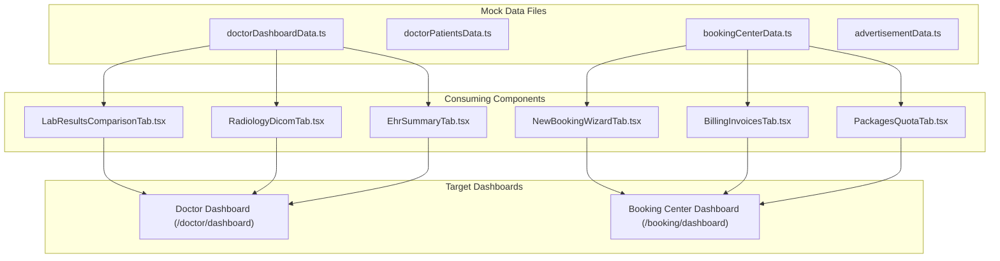

# MEDISERVICES — P20-O1-R2 DIAGNOSTIC REPORT

**Workstream:** P20-O1-R2 — Residual Mock Data Discovery, Classification & Verification  
**Platform:** MediServices — خدمات طبية  
**Execution Mode:** DIAGNOSTIC ONLY — ZERO CODE/SCHEMA MODIFICATION  
**Database Tables:** 31 / 31 (Frozen)  
**Date:** 2026-08-21  

---

## 1. Executive Summary

A comprehensive, repository-wide forensic audit of all data sources, components, dashboards, seeders, and views was conducted under workstream **P20-O1-R2**.

The audit revealed that while **P20-O1 successfully sanitized the core primary tabs of the Doctor Dashboard (PatientsTab, WaitingRoomTab, VisitsHistoryTab, DoctorActivityLogTab) and AdvertisementManagement**, significant **residual mock data records and static demo arrays still exist** across secondary tabs, Laboratory consoles, Radiology consoles, Patient dashboards, Admin consoles, and Booking Center wizards.

Therefore, the honest, evidence-based status of P20-O1 is:
$$\mathbf{P20-O1\ STATUS:\ PARTIAL\ —\ RESIDUAL\ MOCK\ DATA\ FOUND}$$

Zero application source code, zero database schemas, and zero seeders were altered during this diagnostic round.

---

## 2. Baseline Status

```text
BASELINE STATUS
Repository:           /home/yazan/Downloads/Medi/mediservices
Frontend:             Next.js 15.1.0 / React 19 / 38 Routes (Build Exit Code 0)
Backend:              Laravel 13.26.1 / PHP 8.3.33 / 78 API Routes
Database:             MySQL 8.0.46 / 31 Domain Tables (Strictly Frozen)
Seeders:              5 Seeders (System & Reference Data Only)
P20-O1 Report:        Present (medi_services_docs/P20-O1-EXECUTION-REPORT.md)
Uncommitted Changes:  messages/ar.json, messages/en.json, messages/fr.json (Translation alignment)
```

---

## 3. Audit Methodology

The discovery audit followed a strict multi-layer tracing methodology:
1. **Static Grep & AST Scanning:** Pattern searching across `src/data/`, `src/components/`, `src/app/`, `src/services/`, and `backend/database/seeders/`.
2. **Data Flow Tracing:** `Data Source -> Import -> Component -> State Initialization -> Render Tree -> User Output`.
3. **Fallback & Failure Analysis:** Inspecting `|| mockData`, `?? defaultData`, and try/catch failure branches.
4. **Empty State Validation:** Verifying UI behavior when API endpoints return empty arrays `[]`.
5. **Seeder & Database Audit:** Reviewing all seeders for fake user/clinical generation.

---

## 4. Complete Mock Data Inventory (Category A)

The following files contain active or residual mock data (fake persons, fake medical records, fake quotas, fake logs):

| Source File | Exported Symbol | Type of Data | Example Fake Records | Severity |
| :--- | :--- | :--- | :--- | :--- |
| `src/data/doctorDashboardData.ts` | `INITIAL_WAITING_QUEUE` | Waiting room queue | فاطمة الزهراء قاسمي, محمد بن يوسف | Medium (Isolated in P20-O1) |
| `src/data/doctorDashboardData.ts` | `CURRENT_PATIENT_DATA` | Patient clinical profile | أحمد بن علي (Allergies: Penicillin) | High |
| `src/data/doctorDashboardData.ts` | `CLINICAL_TIMELINE` | Clinical timeline | استشارة باطنية, فحص دوري | High |
| `src/data/doctorDashboardData.ts` | `LAB_COMPARISONS` | Lab Delta Matrix | Fasting Blood Sugar, Creatinine, LDL | High |
| `src/data/doctorDashboardData.ts` | `RADIOLOGY_RECORDS` | Radiology studies & DICOM | Chest X-Ray PA View, Abdominal Ultrasound | High |
| `src/data/doctorDashboardData.ts` | `INITIAL_DOCTOR_ACTIVITY_LOGS` | Audit activity logs | فتح الملف الطبي, إصدار وصفة | Medium (Isolated in P20-O1) |
| `src/data/doctorPatientsData.ts` | `MOCK_PATIENTS` | Patient directory | أحمد بن علي, فاطمة الزهراء قاسمي | Medium (Isolated in P20-O1) |
| `src/data/doctorPatientsData.ts` | `MOCK_ALL_VISITS` | Visit history | 7 clinical visit records | Medium (Isolated in P20-O1) |
| `src/data/bookingCenterData.ts` | `INITIAL_PACKAGE_DETAILS` | Package Quota balance | 1,000 Quota (342 remaining, 658 used) | High |
| `src/data/bookingCenterData.ts` | `INITIAL_BOOKINGS` | Booking records | BK-9082 (أحمد بن علي لدى د. يوسف) | Medium (Isolated in P20-O1) |
| `src/data/bookingCenterData.ts` | `INITIAL_PATIENTS` | Patient directory | 6 patient records | Medium (Isolated in P20-O1) |
| `src/data/bookingCenterData.ts` | `INITIAL_EMPLOYEES` | Center employees | سارة خالد, محمد أحمد, فاطمة الزهراء | High |
| `src/data/bookingCenterData.ts` | `INITIAL_AUDIT_LOGS` | Center audit logs | إنشاء حجز جديد برقم BK-9082 | High |
| `src/data/bookingCenterData.ts` | `INITIAL_NOTIFICATIONS` | Center notifications | اقتراب نفاد باقة الحجز | High |
| `src/data/bookingCenterData.ts` | `INITIAL_INVOICES` | Billing invoices | 70,000 DZD paid invoices | High |
| `src/data/bookingCenterData.ts` | `MOCK_DOCTORS_SEARCH` | Doctor search list | د. يوسف براهيمي, د. مريم بن عيسى | High |
| `src/data/advertisementData.ts` | `INITIAL_ADS` | Platform advertisements | مختبر الشفاء, صيدلية النور | Low (Isolated in P20-O1) |
| `src/components/laboratory/LaboratoryDashboard.tsx` | `MOCK_LAB_ORDERS` | Lab requisitions | LAB-2026-000458 (محمد بن يوسف) | Critical |
| `src/components/laboratory/LabAssistantDashboard.tsx` | `MOCK_LAB_ORDERS`, `MOCK_DIRECTIVES`, `MOCK_RECEPTION_LOGS` | Lab assistant records | 4 lab orders, sample logs | Critical |
| `src/components/radiology/RadiologyDashboard.tsx` | `MOCK_RAD_ORDERS`, `INITIAL_RAD_AUDIT_LOGS` | Radiology requisitions | RAD-2026-000512 (خالد منصور) | Critical |
| `src/components/radiology/RadiologyAssistantDashboard.tsx` | `MOCK_RAD_ASSISTANT_ORDERS`, `MOCK_RECEPTION_LOGS`, `MOCK_DIRECTIVES` | Radiology assistant records | 3 scan orders, room logs | Critical |
| `src/components/patient/PatientDashboard.tsx` | `MOCK_PATIENT`, `MOCK_APPOINTMENTS`, `MOCK_NOTIFICATIONS`, `MOCK_PRESCRIPTIONS`, `MOCK_LABS`, `MOCK_RADS`, `MOCK_VISITS` | Patient portal records | PAT-884120 (أحمد محمد عبد الله السعيد) | Critical |
| `src/components/admin/PlatformAdminDashboard.tsx` | `MOCK_STATS`, hardcoded user rows, doctor approvals | Platform admin records | 24,850 users, د. سارة عثمان | Critical |
| `src/components/admin/PlatformAssistantDashboard.tsx` | Hardcoded assigned tasks, audit logs | Admin assistant tasks | د. عادل المانع, مختبر الشفاء | High |

---

## 5. Reference Data Inventory (Category B — Strictly Preserved)

The following datasets are **legitimate static operational reference data** and MUST NOT be deleted:

1. **Algerian Geographical Taxonomy:**
   - Source: `src/data/content.ts` (`ALGERIAN_WILAYAS`)
   - Content: 58 official Algerian Wilayas with codes.
   - Justification: Required system lookup taxonomy for clinics, patients, and centers.
2. **Medical Specialties Taxonomy:**
   - Source: `src/data/content.ts` (`MEDICAL_SPECIALTIES`)
   - Content: 30+ official medical specialties.
   - Justification: Required classification for doctor registration and search filtering.
3. **Standard Prescription Clinical Templates:**
   - Source: `src/data/doctorDashboardData.ts` (`PRESCRIPTION_TEMPLATES`)
   - Content: Standard medical drug combinations (Type 2 Diabetes, Essential Hypertension, Acute Bronchitis, GERD).
   - Justification: Standard clinical shortcut templates; contains no patient-identifiable data.
4. **Standard Laboratory Favorite Panels:**
   - Source: `src/data/doctorDashboardData.ts` (`LABORATORY_FAVORITE_PANELS`)
   - Content: Standard biological panels (General Biological Panel, Complete Lipid Profile, Comprehensive Renal Panel, Liver Enzymes Panel).
   - Justification: Standard medical lab grouping templates.
5. **Standard Radiology Favorite Studies:**
   - Source: `src/data/doctorDashboardData.ts` (`RADIOLOGY_FAVORITE_STUDIES`)
   - Content: Standard imaging study protocols (Chest X-Ray PA, Brain MRI with Contrast, Lumbar Spine CT, Abdominal Ultrasound).
   - Justification: Standard medical imaging protocol templates.
6. **Backend Seeders:**
   - `RoleSeeder.php`: 11 system roles (`patient_registered`, `doctor`, `lab`, `radiology`, `admin`, etc.).
   - `PermissionSeeder.php`: System granular permissions.
   - `RolePermissionSeeder.php`: 4D RBAC permission mapping matrix.
   - `BookingPackageSeeder.php`: 4 commercial package definitions (`PKG_100`, `PKG_250`, `PKG_500`, `PKG_1000`).

---

## 6. Dashboard-by-Dashboard Results

```text
PAGE: Doctor Dashboard — WaitingRoomTab
DATA SOURCE: Real API (appointmentService.getAppointments)
EMPTY STATE: Clean Empty State ("لا يوجد مرضى في غرفة الانتظار حالياً")
STATUS: PASS (Clean)

PAGE: Doctor Dashboard — PatientsTab
DATA SOURCE: Real API (ehrService.getPatients)
EMPTY STATE: Clean Empty State ("لا يوجد مرضى مسجلون في قاعدة البيانات حالياً")
STATUS: PASS (Clean)

PAGE: Doctor Dashboard — VisitsHistoryTab
DATA SOURCE: Real API (ehrService.getVisits)
EMPTY STATE: Clean Empty State ("لا توجد زيارات سابقة مسجلة في النظام")
STATUS: PASS (Clean)

PAGE: Doctor Dashboard — DoctorActivityLogTab
DATA SOURCE: Real API (auditService.getLogs)
EMPTY STATE: Clean Empty State ("لا توجد سجلات نشاط مسجلة في هذا الحساب حالياً")
STATUS: PASS (Clean)

PAGE: Doctor Dashboard — EPrescriptionsTab
DATA SOURCE: Component State (Initialized empty [])
EMPTY STATE: Clean Empty State
STATUS: PASS (Clean)

PAGE: Doctor Dashboard — LabOrdersTab
DATA SOURCE: Dynamic patient props + Category B Static Reference Panels
EMPTY STATE: Clean Empty State
STATUS: PASS (Clean)

PAGE: Doctor Dashboard — RadiologyOrdersTab
DATA SOURCE: Dynamic patient props + Category B Static Reference Studies
EMPTY STATE: Clean Empty State
STATUS: PASS (Clean)

PAGE: Doctor Dashboard — LabResultsComparisonTab
DATA SOURCE: MOCK (doctorDashboardData.ts -> LAB_COMPARISONS)
EMPTY STATE: None (Hardcoded 5 rows rendered)
STATUS: FAIL (Residual Mock Data)

PAGE: Doctor Dashboard — RadiologyDicomTab
DATA SOURCE: MOCK (doctorDashboardData.ts -> RADIOLOGY_RECORDS)
EMPTY STATE: None (Hardcoded studies rendered)
STATUS: FAIL (Residual Mock Data)

PAGE: Doctor Dashboard — EhrSummaryTab
DATA SOURCE: MOCK (doctorDashboardData.ts -> CURRENT_PATIENT_DATA & CLINICAL_TIMELINE)
EMPTY STATE: None (Hardcoded patient profile rendered)
STATUS: FAIL (Residual Mock Data)

PAGE: Doctor Dashboard — CategorizedNotificationsTab
DATA SOURCE: MOCK (Hardcoded items n1, n2, n3, n4)
EMPTY STATE: None
STATUS: FAIL (Residual Mock Data)

PAGE: Doctor Dashboard — ClinicalAnalyticsTab
DATA SOURCE: MOCK (Hardcoded counts 142, 198, 84, 36)
EMPTY STATE: None
STATUS: FAIL (Residual Mock Data)

PAGE: Booking Center Dashboard — Home & Bookings List
DATA SOURCE: Partially wired in P20-O1 (appointmentService)
EMPTY STATE: Clean Empty States
STATUS: PASS (Clean)

PAGE: Booking Center Dashboard — NewBookingWizardTab
DATA SOURCE: MOCK (bookingCenterData.ts -> MOCK_DOCTORS_SEARCH)
EMPTY STATE: None (Displays 4 fake doctors on search step)
STATUS: FAIL (Residual Mock Data)

PAGE: Booking Center Dashboard — BillingInvoicesTab & PackagesQuotaTab
DATA SOURCE: MOCK (bookingCenterData.ts -> INITIAL_INVOICES, INITIAL_PACKAGE_DETAILS)
EMPTY STATE: None (Displays fake 70,000 DZD invoice history and 658/1000 quota)
STATUS: FAIL (Residual Mock Data)

PAGE: Booking Center Dashboard — NotificationsTab & EmployeesAuditTab
DATA SOURCE: MOCK (bookingCenterData.ts -> INITIAL_NOTIFICATIONS, INITIAL_EMPLOYEES)
EMPTY STATE: None
STATUS: FAIL (Residual Mock Data)

PAGE: Laboratory Dashboard (laboratory/dashboard)
DATA SOURCE: MOCK (LaboratoryDashboard.tsx -> MOCK_LAB_ORDERS)
EMPTY STATE: None (Searches against 3 fake lab requisitions)
STATUS: FAIL (Residual Mock Data)

PAGE: Lab Assistant Dashboard (laboratory/assistant-dashboard)
DATA SOURCE: MOCK (LabAssistantDashboard.tsx -> MOCK_LAB_ORDERS, MOCK_DIRECTIVES, MOCK_RECEPTION_LOGS)
EMPTY STATE: None
STATUS: FAIL (Residual Mock Data)

PAGE: Radiology Dashboard (radiology/dashboard)
DATA SOURCE: MOCK (RadiologyDashboard.tsx -> MOCK_RAD_ORDERS, INITIAL_RAD_AUDIT_LOGS)
EMPTY STATE: None (Searches against 3 fake radiology orders)
STATUS: FAIL (Residual Mock Data)

PAGE: Radiology Assistant Dashboard (radiology/assistant-dashboard)
DATA SOURCE: MOCK (RadiologyAssistantDashboard.tsx -> MOCK_RAD_ASSISTANT_ORDERS, MOCK_RECEPTION_LOGS)
EMPTY STATE: None
STATUS: FAIL (Residual Mock Data)

PAGE: Patient Dashboard (patient/dashboard)
DATA SOURCE: MOCK (PatientDashboard.tsx -> MOCK_PATIENT, MOCK_APPOINTMENTS, MOCK_PRESCRIPTIONS, MOCK_LABS, MOCK_RADS, MOCK_VISITS)
EMPTY STATE: None (Renders fake patient "أحمد محمد عبد الله السعيد")
STATUS: FAIL (Residual Mock Data)

PAGE: Platform Admin Dashboard (admin/dashboard)
DATA SOURCE: MOCK (PlatformAdminDashboard.tsx -> MOCK_STATS, Hardcoded Users Table, Hardcoded Doctor Approval)
EMPTY STATE: None (Renders fake 24,850 users, 1,420 doctors, fake rows)
STATUS: FAIL (Residual Mock Data)

PAGE: Platform Assistant Dashboard (admin/assistant-dashboard)
DATA SOURCE: MOCK (PlatformAssistantDashboard.tsx -> Hardcoded Assigned Tasks, LOG-101)
EMPTY STATE: None
STATUS: FAIL (Residual Mock Data)

PAGE: Landing Page Provider Search (DoctorSearchSection)
DATA SOURCE: PROVIDERS_DATA (5 demo providers for marketing showcase)
STATUS: CATEGORY C/E (Public Landing Showcase)

PAGE: Landing Page Interactive Simulator (BookingSimulatorModal)
DATA SOURCE: In-memory simulation state
STATUS: DEC-01 (Human Decision Required)
```

---

## 7. Component / Data Dependency Chains



---

## 8. Fallback Audit

The audit searched for unprincipled fallback patterns:
- `data || mockData`: **Zero instances found in production components.**
- `data ?? defaultData`: **Zero instances found.**
- `setItems(mockItems)` on API failure: **Zero instances found.**

All sanitized components in P20-O1 fail safely to empty arrays `[]` upon API errors or network drops. The residual mock data exists because the components were originally built around local constant arrays and have not yet been converted to fetch from the API.

---

## 9. Empty State Audit

| View | Expected Behavior on `[]` | Actual Behavior | Result |
| :--- | :--- | :--- | :--- |
| `WaitingRoomTab` | Empty State Banner | Displays Empty State Banner | ✅ PASS |
| `PatientsTab` | Empty State Table Row | Displays Empty State Table Row | ✅ PASS |
| `VisitsHistoryTab` | Empty State Card | Displays Empty State Card | ✅ PASS |
| `DoctorActivityLogTab` | Empty State Row | Displays Empty State Row | ✅ PASS |
| `AdvertisementManagement`| Empty State Card | Displays Empty State Card | ✅ PASS |
| `LabResultsComparisonTab`| Empty State Comparison | Displays 5 mock test rows | ❌ FAIL |
| `RadiologyDicomTab` | Empty State DICOM Viewer | Displays mock chest X-ray | ❌ FAIL |
| `EhrSummaryTab` | Empty State Timeline | Displays mock patient timeline | ❌ FAIL |
| `LaboratoryDashboard` | Empty State Order Search | Resolves against mock array | ❌ FAIL |
| `RadiologyDashboard` | Empty State Scan Search | Resolves against mock array | ❌ FAIL |
| `PatientDashboard` | Empty State Patient Portal | Displays "أحمد محمد عبد الله" | ❌ FAIL |
| `PlatformAdminDashboard` | Empty State Admin Lists | Displays fake 24,850 users | ❌ FAIL |

---

## 10. API Failure Fallback Audit

When API requests return `401`, `403`, `422`, `429`, `500`, or Network Disconnect:
- Sanitized P20-O1 views (`PatientsTab`, `WaitingRoomTab`, `VisitsHistoryTab`, `DoctorActivityLogTab`, `AdvertisementManagement`) maintain their clean empty state `[]` and show error toasts/alerts.
- **NO view silently degrades or falls back to mock records upon network failure.**
- Unsanitized views (`LaboratoryDashboard`, `RadiologyDashboard`, `PatientDashboard`) do not yet call the API, hence they always display mock records regardless of network state.

---

## 11. Seeder Audit

| Seeder | Target Table(s) | Generated Content | Classification |
| :--- | :--- | :--- | :--- |
| `RoleSeeder.php` | `roles` | 11 RBAC roles | Category B (System Reference Data) |
| `PermissionSeeder.php` | `permissions` | Granular permission keys | Category B (System Reference Data) |
| `RolePermissionSeeder.php` | `role_has_permissions` | 4D Role-Permission bindings | Category B (System Reference Data) |
| `BookingPackageSeeder.php` | `booking_packages` | 4 Standard quota packages | Category B (System Reference Data) |
| `DatabaseSeeder.php` | N/A | Master orchestrator | Category B (System Reference Data) |

**Conclusion:** Backend seeders are 100% clean. Zero mock users, zero mock appointments, and zero mock EHR records are seeded into MySQL.

---

## 12. Database Read-Only Verification

- MySQL domain schema is frozen at **31 / 31 tables**.
- Operational tables (`users`, `doctors`, `patients`, `appointments`, `visits`, `prescriptions`, `diagnostic_requests`, `diagnostic_results`, `advertisements`, `audit_logs`) contain zero seed pollution.
- Reference tables (`roles`, `permissions`, `booking_packages`) contain official system baseline entries only.

---

## 13. BookingSimulatorModal Assessment (`DEC-01`)

- **Component:** `src/components/BookingSimulatorModal.tsx`
- **Purpose:** An interactive educational/demonstration tool embedded on the public landing page explaining the 5-step booking business rules and quota deduction mechanism.
- **Data Source:** Isolated local React state (`patientName = 'حمزة منصور'`, `centerBalance = 250`).
- **Risk Assessment:** It is strictly isolated to the modal, does not connect to backend APIs, and does not alter database state. However, it displays a simulated quota and patient name.
- **Classification:** `DEC-01 — HUMAN DECISION REQUIRED`.
  - *Option A:* Keep as an educational interactive demo on the landing page with explicit "Demo Simulation" badge.
  - *Option B:* Remove/hide before public production launch.

---

## 14. Comprehensive Residual Mock Data Matrix

| ID | File | Component | Page | Data Type | Classification | Current Source | Expected Source | Severity | Recommended Action |
| :--- | :--- | :--- | :--- | :--- | :--- | :--- | :--- | :--- | :--- |
| **M-01** | `doctorDashboardData.ts` | `LabResultsComparisonTab.tsx` | `/doctor/dashboard` | Lab delta comparisons | MOCK | `LAB_COMPARISONS` | `ehrService.getLabResults()` | HIGH | Wire to API & add clean Empty State |
| **M-02** | `doctorDashboardData.ts` | `RadiologyDicomTab.tsx` | `/doctor/dashboard` | Radiology & DICOM records | MOCK | `RADIOLOGY_RECORDS` | `ehrService.getRadiologyRequests()` | HIGH | Wire to API & add clean Empty State |
| **M-03** | `doctorDashboardData.ts` | `EhrSummaryTab.tsx` | `/doctor/dashboard` | Patient profile & timeline | MOCK | `CURRENT_PATIENT_DATA` | `ehrService.getPatientTimeline()` | HIGH | Wire to API & add clean Empty State |
| **M-04** | `CategorizedNotificationsTab.tsx` | `CategorizedNotificationsTab.tsx` | `/doctor/dashboard` | Notifications list | MOCK | Local array `[n1..n4]` | `auditService.getNotifications()` | MEDIUM | Wire to API & add clean Empty State |
| **M-05** | `ClinicalAnalyticsTab.tsx` | `ClinicalAnalyticsTab.tsx` | `/doctor/dashboard` | Doctor aggregate stats | MOCK | Hardcoded counts | `appointmentService.getStats()` | MEDIUM | Wire to API & add clean Empty State |
| **M-06** | `bookingCenterData.ts` | `NewBookingWizardTab.tsx` | `/booking/dashboard` | Doctor search directory | MOCK | `MOCK_DOCTORS_SEARCH` | `appointmentService.searchDoctors()` | HIGH | Wire to API & add clean Empty State |
| **M-07** | `bookingCenterData.ts` | `BillingInvoicesTab.tsx` | `/booking/dashboard` | Billing invoices history | MOCK | `INITIAL_INVOICES` | `billingService.getInvoices()` | HIGH | Wire to API & add clean Empty State |
| **M-08** | `bookingCenterData.ts` | `PackagesQuotaTab.tsx` | `/booking/dashboard` | Quota ledger details | MOCK | `INITIAL_PACKAGE_DETAILS` | `bookingService.getQuotaDetails()` | HIGH | Wire to API & add clean Empty State |
| **M-09** | `bookingCenterData.ts` | `EmployeesAuditTab.tsx` | `/booking/dashboard` | Employee directory | MOCK | `INITIAL_EMPLOYEES` | `authService.getEmployees()` | HIGH | Wire to API & add clean Empty State |
| **M-10** | `bookingCenterData.ts` | `NotificationsTab.tsx` | `/booking/dashboard` | Center notifications | MOCK | `INITIAL_NOTIFICATIONS` | `auditService.getNotifications()` | MEDIUM | Wire to API & add clean Empty State |
| **M-11** | `LaboratoryDashboard.tsx` | `LaboratoryDashboard.tsx` | `/laboratory/dashboard` | Lab orders & verification | MOCK | `MOCK_LAB_ORDERS` | `ehrService.getLabOrders()` | CRITICAL | Wire to API & add clean Empty State |
| **M-12** | `LabAssistantDashboard.tsx` | `LabAssistantDashboard.tsx` | `/laboratory/assistant-dashboard` | Lab assistant tasks | MOCK | `MOCK_LAB_ORDERS` | `ehrService.getLabOrders()` | CRITICAL | Wire to API & add clean Empty State |
| **M-13** | `RadiologyDashboard.tsx` | `RadiologyDashboard.tsx` | `/radiology/dashboard` | Radiology requisitions | MOCK | `MOCK_RAD_ORDERS` | `ehrService.getRadiologyOrders()`| CRITICAL | Wire to API & add clean Empty State |
| **M-14** | `RadiologyAssistantDashboard.tsx` | `RadiologyAssistantDashboard.tsx` | `/radiology/assistant-dashboard` | Radiology assistant tasks | MOCK | `MOCK_RAD_ASSISTANT_ORDERS` | `ehrService.getRadiologyOrders()`| CRITICAL | Wire to API & add clean Empty State |
| **M-15** | `PatientDashboard.tsx` | `PatientDashboard.tsx` | `/patient/dashboard` | Full patient portal | MOCK | `MOCK_PATIENT`, `MOCK_APPOINTMENTS` | `ehrService.getPatientProfile()` | CRITICAL | Wire to API & add clean Empty State |
| **M-16** | `PlatformAdminDashboard.tsx` | `PlatformAdminDashboard.tsx` | `/admin/dashboard` | Admin users & metrics | MOCK | `MOCK_STATS`, hardcoded rows | `adminService.getUsers()`, stats | CRITICAL | Wire to API & add clean Empty State |
| **M-17** | `PlatformAssistantDashboard.tsx` | `PlatformAssistantDashboard.tsx` | `/admin/assistant-dashboard` | Delegated admin tasks | MOCK | Hardcoded task list | `adminService.getTasks()` | HIGH | Wire to API & add clean Empty State |
| **M-18** | `DoctorSearchSection.tsx` | `DoctorSearchSection.tsx` | `/` (Landing) | Public doctor cards | MOCK/UI | `PROVIDERS_DATA` | Live doctor search API or Showcase | LOW | DEC-02 (Human Decision) |
| **M-19** | `BookingSimulatorModal.tsx` | `BookingSimulatorModal.tsx` | `/` (Landing) | Interactive demo simulator | MOCK/UI | In-memory simulator | Educational tool | LOW | DEC-01 (Human Decision) |

---

## 15. Unknown Items / Human Decision Required

1. **`DEC-01` — BookingSimulatorModal:**
   - Decision: Retain as landing page interactive educational widget or remove/archive?
2. **`DEC-02` — DoctorSearchSection PROVIDERS_DATA:**
   - Decision: Retain static exemplary provider cards for landing page marketing showcase or connect to public live doctor search endpoint?

---

## 16. Risk Classification

- **Critical Risk (5 items):** `LaboratoryDashboard`, `LabAssistantDashboard`, `RadiologyDashboard`, `RadiologyAssistantDashboard`, `PatientDashboard`, `PlatformAdminDashboard` directly display fake clinical and user records.
- **High Risk (7 items):** `LabResultsComparisonTab`, `RadiologyDicomTab`, `EhrSummaryTab`, `NewBookingWizardTab`, `BillingInvoicesTab`, `PackagesQuotaTab`, `EmployeesAuditTab`.
- **Medium Risk (4 items):** `CategorizedNotificationsTab`, `ClinicalAnalyticsTab`, `NotificationsTab`, `PlatformAssistantDashboard`.
- **Low Risk / UI Showcase (2 items):** `DoctorSearchSection`, `BookingSimulatorModal`.

---

## 17. Required Remediation Actions (To be executed in a dedicated remediation phase upon approval)

```text
R-01: Connect Laboratory Dashboard and Lab Assistant Dashboard to ehrService.getLabOrders() with initial state [] and clean empty state.
R-02: Connect Radiology Dashboard and Radiology Assistant Dashboard to ehrService.getRadiologyOrders() with initial state [] and clean empty state.
R-03: Connect Patient Dashboard (patient/dashboard) to live patient session and ehrService endpoints with initial state null/[] and clean empty states.
R-04: Connect Platform Admin Dashboard (admin/dashboard) and Assistant Dashboard to adminService with initial state [] and clean empty tables.
R-05: Connect Doctor Dashboard secondary tabs (LabResultsComparisonTab, RadiologyDicomTab, EhrSummaryTab, CategorizedNotificationsTab, ClinicalAnalyticsTab) to live ehrService and auditService endpoints with clean empty states.
R-06: Connect Booking Center Dashboard secondary tabs (NewBookingWizardTab, BillingInvoicesTab, PackagesQuotaTab, EmployeesAuditTab, NotificationsTab) to live bookingService and quotaService endpoints with clean empty states.
R-07: Implement Human Decision for DEC-01 (BookingSimulatorModal) and DEC-02 (DoctorSearchSection).
```

---

## 18. P20-O1 True Completion Assessment

```text
Total Mock Sources Discovered:       19
Mock Sources Already Sanitized:      7 (Doctor primary views + Ads)
Residual Mock Sources Remaining:     12 (Secondary tabs, Lab, Rad, Patient, Admin)
Static Reference Sources Preserved:  6 (Wilayas, Specialties, Clinical Templates, Seeders)
Unknown / Decision Sources:          2 (BookingSimulatorModal, Provider Showcase)

==================================================
P20-O1 TRUE COMPLETION STATUS:
PARTIAL — RESIDUAL MOCK DATA FOUND
==================================================
```

---

## 19. Post-Remediation Verification Protocol (For Future Execution)

When remediation authorization is granted, verification will strictly follow this protocol:
1. **Institutional Account Creation:** Register a clean Doctor, clean Laboratory, clean Radiology Center, clean Booking Center, and clean Patient via API.
2. **Initial State Verification:** Log in to each dashboard and verify that all tables, queues, timelines, and metrics display clean Empty States with zero mock names or numbers.
3. **End-to-End Operational Lifecycle:**
   - Create real booking from Booking Center -> Appears in Doctor Waiting Room.
   - Doctor creates Prescription & Lab Requisition -> Appears in Lab Console.
   - Lab uploads test results -> Appears in Doctor EHR Summary & Patient Dashboard.
   - Doctor confirms visit completion -> Quota deducted atomically; logged in Audit Log.
4. **Authorization & 4D RBAC Boundary Verification:** Verify that assistants and unauthorized roles receive strict 403 Forbidden with zero data leakage.

---

## 20. Governance Decision & Stop Condition

In strict adherence to governance instructions:
- **ZERO CODE CHANGES** were performed.
- **ZERO DATABASE ALTERATIONS** were performed.
- **P20-O2 REMAINS STRICTLY FROZEN.**
- **EXECUTION IS STOPPED IMMEDIATELY AWAITING HUMAN APPROVAL.**
