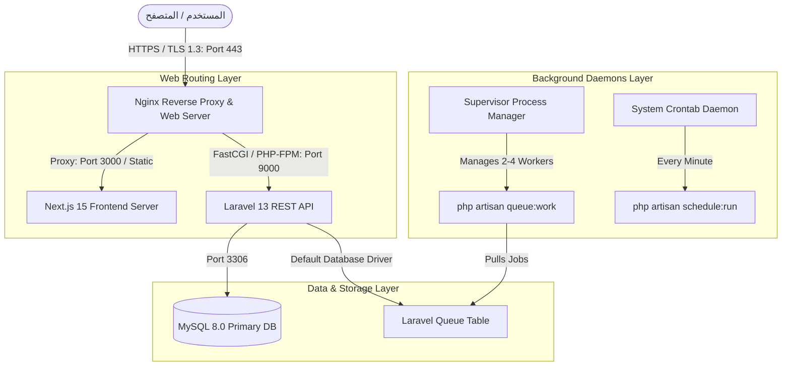

# خطة التنفيذ الهندسية والرقابية لمسار العمل P20-O5
## MEDISERVICES — P20-O5 DETAILED EXECUTION PLAN
### Production Infrastructure, Nginx Reverse Proxy & Supervisor Daemons

**المشروع:** MediServices — المنصة الوطنية الطبية الرقمية الموحدة  
**المرحلة:** P20 — الجاهزية التشغيلية والتحصين الإنتاجي  
**مسار العمل المستهدف:** `P20-O5` — تجهيز البنية التحتية للإنتاج، وسيط Nginx، وعمال الطوابير Supervisor Daemons  
**طبيعة الوثيقة:** **خطة هندسية تفصيلية ومقترحة (READ-ONLY PROPOSAL — AWAITING HUMAN APPROVAL)**  
**تاريخ الصياغة:** 2026-08-23 06:31:00 UTC+1  
**وكيل التخطيط المعماري:** Antigravity  
**الحالة الحالية:** **`P20-O5: NOT STARTED — STRICTLY FROZEN (PROPOSAL ONLY)`**  

---

## 1. الحالة الرقابية لبرنامج العمل (Governance Status)

```text
======================================================================
MEDISERVICES — WORKSTREAM LIFECYCLE BASELINE
======================================================================
- P20-O1 : Mock Data Audit & Purge           → FORMALLY CLOSED ✅
- P20-O2 : Clean Database Initialization     → FORMALLY CLOSED ✅
- P20-O3 : Environment Separation & Hardening → FORMALLY CLOSED ✅
- P20-O4 : Security & Privacy Hardening Audit→ FORMALLY CLOSED ✅
- P20-O5 : Production Infrastructure Plan    → PROPOSAL ONLY — NOT STARTED 🛑
- P20-O6+: Backup, Telemetry, Pilot & Go-Live→ STRICTLY FROZEN 🛑
======================================================================
```

> [!IMPORTANT]
> **التزام الحوكمة الصارم:**  
> هذه الوثيقة هي **مقترح خطة للقراءة فقط (Read-Only Proposal)** ولا تُمثل تفويضاً بالتنفيذ.  
> لا يجوز تشغيل أي خدمات، أو تعديل إعدادات الخادم، أو إجراء أي Mutation حتى صدور تفويض بشري صريح للبوابة `G0`.

---

## 2. الهدف الرسمي وحدود مسار العمل (Official Objective & Boundaries)

### أ. لماذا يوجد المسار P20-O5؟
يهدف مسار `P20-O5` إلى سد الفجوة التشغيلية بين بيئة التطوير المحلية المعتمدة على الأوامر المؤقتة (`php artisan serve` و `npm run dev`) وبين **بيئة الإنتاج الحقيقية عالية التوافر (Enterprise Production Infrastructure)**.

### ب. ما المشكلة التشغيلية التي يعالجها؟
1. **معالجة العمليات غير المتزامنة في الخلفية:** معالجة مهام إرسال الإشعارات والبريد وتجميع سجلات التدقيق السريري عبر طوابير Laravel Queues دون تعطيل استجابة المتصفح للمستخدم.
2. **ضمان استمرارية الخدمات (High Availability):** تشغيل وإدارة عمال الطوابير تحت نظام **Supervisor** لضمان إعادة التشغيل التلقائي الفوري في حال حدوث أي انهيار أو توقف للعملية.
3. **أتمتة المهام المجدولة (Task Scheduling):** ربط مجدول مهام Laravel (`php artisan schedule:run`) عبر مجدول النظام Cron.
4. **توجيه وعزل حركة المرور (Reverse Proxy & Routing):** إعداد وتوثيق إعدادات Nginx لتوجيه نطاقات الواجهة (`mediservices.dz`) والـ API (`api.mediservices.dz`) وتطبيق شهادات التشفير SSL/TLS 1.3.
5. **تسريع الأداء الإنتاجي (Production Caching):** إعداد حزم التخزين المؤقت للإعدادات والمسارات (`config:cache`, `route:cache`, `view:cache`).

### ج. ما الخدمات التي تقع خارج نطاق P20-O5؟
* ❌ لا يشمل النسخ الاحتياطي وتجارب الاستعادة (مجدول في `P20-O6`).
* ❌ لا يشمل أدوات الرصد والمراقبة الحية APM (مجدول في `P20-O7`).
* ❌ لا يشمل اختبارات رحلات المستخدمين السريرية (مجدول في `P20-O8`).

---

## 3. القيود الموروثة والحفاظ على خط الأساس (Inherited Constraints)

* 🛑 **حماية قاعدة البيانات الأساسية:** بقاء `medical_db` محمية ونظيفة بنسبة 100% (0 تعديلات أثناء البنية التحتية).
* 🛑 **استمرار سياسة نقاء الإنتاج (Zero Mock Data):** الجداول التشغيلية الـ 25 تبقى عند **0 سجل**.
* 🛑 **عزل بيئة الاختبارات:** الحفاظ على `medical_db_testing` كبيئة اختبارية حصرية لاختبارات PHPUnit.
* 🛑 **ثبات القرارات السابقة:** إغلاق P20-O1 إلى P20-O4 يظل نهائياً وغير قابل للتعديل بأثر رجعي.
* 🛑 **تجميد المسارات اللاحقة:** `P20-O6` وما بعدها تبقى مجمدة كلياً (`STRICTLY FROZEN`).

---

## 4. المخطط المعماري لتدفق الإنتاج (Production Deployment Architecture)



---

## 5. هيكل البوابات المقترح للمسار P20-O5 (Proposed Gate Architecture)

| البوابة | الاسم والتعريف | طبيعة البوابة | المدخلات الأساسية | المخرجات المتوقعة | معايير القبول والاجتياز |
|---|---|---|---|---|---|
| **`Gate G0`** | **Human Authorization & Scope Alignment** | Read-Only | تفويض بشري صريح | `P20-O5-G0-AUTHORIZATION-RECORD.md` | تسجيل التفويض وتثبيت النطاق والمهام |
| **`Gate G1`** | **Pre-Execution Infrastructure & Baseline Audit** | Read-Only | فحص بيئة الخادم | `P20-O5-G1-PRE-EXECUTION-AUDIT.md` | إثبات إصدارات PHP 8.3, Node, MySQL, Nginx |
| **`Gate G2`** | **Nginx Reverse Proxy & SSL/TLS Configuration Blueprint** | Configuration | قوالب Nginx | `nginx/mediservices.conf`, `ssl/` | توثيق إعدادات النطاقات والـ SSL 1.3 والترويسات |
| **`Gate G3`** | **Supervisor Queue Workers & Scheduler Daemon Blueprint** | Configuration | قوالب Supervisor | `supervisor/laravel-worker.conf`, `cron` | إعداد عمال الطوابير (2-4 workers) ومجدول المهام |
| **`Gate G4`** | **Isolated Automated Verification & Syntax Validation** | Verification | ملفات التكوين | `P20-O5-G4-VERIFICATION-REPORT.md` | اجتياز فحص الـ Syntax واختبارات PHPUnit (76/76) |
| **`Gate G5`** | **Documentation & Master Execution Report Finalization** | Documentation | مخرجات G0..G4 | `P20-O5-EXECUTION-REPORT.md` | إعداد التقرير التنفيذي والرقابي الشامل |
| **`Gate G6`** | **Formal Workstream Closure & Handoff Gate** | Closure | اعتماد G5 | `P20-O5-G6-CLOSURE-HANDOFF.md` | الإغلاق الرسمي 100% وتجميد P20-O6+ |

---

## 6. سجل المهام التفصيلي لمسار P20-O5 (Task Register)

| معرف المهمة | عنوان وهدف المهمة الهندسية | المكونات المفحوصة | نوع المهمة | مستوى الخطر | الاعتماديات |
|---|---|---|---|---|---|
| **`T-O5-01`** *(PROPOSED)* | تدقيق متطلبات خادم الإنتاج والحزم البرمجية | PHP 8.3-FPM, Node.js, MySQL 8.0 | READ-ONLY | منخفض | G0 |
| **`T-O5-02`** *(PROPOSED)* | إعداد وتوثيق قالب Nginx للواجهة و API | `nginx/conf.d/mediservices.conf` | CONFIGURATION | عالي | T-O5-01 |
| **`T-O5-03`** *(PROPOSED)* | توثيق سياسة تشفير SSL/TLS 1.3 وإعادة التوجيه | `nginx/snippets/ssl-params.conf` | CONFIGURATION | عالي | T-O5-02 |
| **`T-O5-04`** *(PROPOSED)* | إعداد قالب عمال الطوابير في Supervisor | `supervisor/conf.d/mediservices-worker.conf` | CONFIGURATION | عالي | T-O5-01 |
| **`T-O5-05`** *(PROPOSED)* | إعداد وتوثيق مجدول المهام التلقائي (Cron) | `cron/mediservices-scheduler` | CONFIGURATION | متوسط | T-O5-01 |
| **`T-O5-06`** *(PROPOSED)* | إعداد بروتوكول التخزين المؤقت للإنتاج | `php artisan config/route/view:cache` | CONFIGURATION | متوسط | T-O5-01 |
| **`T-O5-07`** *(PROPOSED)* | التحقق الآلي وفحص سلامة التكوين واختبارات PHPUnit | Nginx lint, Supervisor check, PHPUnit | VERIFICATION | منخفض | T-O5-02..06 |
| **`T-O5-08`** *(PROPOSED)* | إعداد التقرير التنفيذي ووثيقة الإغلاق الرسمي | `medi_services_docs/` | DOCUMENTATION | منخفض | T-O5-07 |

---

## 7. التفاصيل الهندسية لمكونات البنية التحتية (Infrastructure Specifications)

### A. إعدادات خادم الإنتاج (Production Server Environment):
* **نظام التشغيل:** Linux (Ubuntu 22.04 LTS / 24.04 LTS).
* **بيئة التشغيل الخلفية:** `PHP 8.3-FPM` مع الامتدادات الأساسية (`pdo_mysql`, `mbstring`, `bcmath`, `xml`, `curl`, `zip`, `opcache`).
* **بيئة التشغيل الأمامية:** `Node.js 20+ LTS` لتشغيل خادم Next.js المستقل (Standalone Node Server).
* **قاعدة البيانات:** `MySQL 8.0 InnoDB` على المنفذ `3306`.
* **مستخدم النظام المعزول:** تشغيل خدمات الويب تحت المستخدم القياسي `www-data` مع منح أذونات `755` للمجلدات و `644` للملفات، وحصر ملكية `backend/storage` و `backend/bootstrap/cache` بـ `www-data`.

### B. وسيط الويب وتوجيه النطاقات (Nginx Reverse Proxy):
* **توجيه الواجهة الأمامية:** استقبال الطلبات على النطاق الرئيسي `https://mediservices.dz` وتحويلها (Reverse Proxy) إلى خادم Next.js المحلي على المنفذ `3000`.
* **توجيه الـ API:** استقبال الطلبات على نطاق الـ API `https://api.mediservices.dz` وتمريرها إلى `PHP-FPM` عبر مقبس `unix:/var/run/php/php8.3-fpm.sock`.
* **قيود وأمان الرفع والمهلة:**
  - الحد الأقصى لحجم المرفقات: `client_max_body_size 10M;` (لحماية الخادم من إغراق الذاكرة أثناء رفع تقارير الأشعة).
  - مهلة الاتصال: `fastcgi_read_timeout 60s;` و `proxy_read_timeout 60s;`.

### C. سياسة التشفير وشهادات الأمان (SSL/TLS Strategy):
* **إلزامية HTTPS:** إعادة توجيه كافة طلبات المنفذ `80` (HTTP) تلقائياً إلى المنفذ `443` (HTTPS) برمز التوجيه الدائم `301 Moved Permanently`.
* **بروتوكولات التشفير المعتمدة:** قصر الاتصال حصراً على `TLSv1.2` و `TLSv1.3` وحظر البروتوكولات القديمة (`TLSv1.0`, `TLSv1.1`, `SSLv3`).
* **تشفير HSTS:** تضمين الترويسة `Strict-Transport-Security: max-age=63072000; includeSubDomains; preload;`.

### D. عمال طوابير العمل في الخلفية (Supervisor Queue Daemons):
* **تعريف الخدمة:**
  ```ini
  [program:mediservices-worker]
  process_name=%(program_name)s_%(process_num)02d
  command=php /var/www/mediservices/backend/artisan queue:work database --sleep=3 --tries=3 --max-time=3600
  autostart=true
  autorestart=true
  user=www-data
  numprocs=2
  redirect_stderr=true
  stdout_logfile=/var/www/mediservices/backend/storage/logs/supervisor-worker.log
  stopwaitsecs=3600
  ```
* **سلوك إعادة التشغيل:** إعادة التشغيل التلقائي الفوري (`autorestart=true`) في حال توقف العملية أو تجاوز الذاكرة، مع حد زمني 3600 ثانية لتجديد عمال الذاكرة النظيفة.

### E. مجدول المهام التلقائي (Cron Task Scheduler):
* **التهيئة:** إضافة أمر واحد في Crontab الخاص بالنظام يعمل كل دقيقة:
  ```bash
  * * * * * cd /var/www/mediservices/backend && php artisan schedule:run >> /dev/null 2>&1
  ```

---

## 8. سجل المخاطر وخطط المعالجة والوقاية (Risk Register)

| معرف الخطر | وصف الخطر المحتمل | الخطورة | الاحتمالية | خطة الوقاية والمعالجة والإنعاش |
|---|---|---|---|---|
| **`RSK-O5-01`** | توقف عمال الطوابير وتراكم مهام البريد والتدقيق | عالي | متوسط | إدارة العمليات عبر Supervisor مع التنبيه الفوري وإعادة التشغيل التلقائي |
| **`RSK-O5-02`** | خطأ في إعدادات Nginx يمنع الاتصال بالـ API | حرج | منخفض | فحص الصياغة مسبقاً عبر `nginx -t` قبل أي تفعيل |
| **`RSK-O5-03`** | تسريب أسرار الخادم في ملفات الإعدادات | حرج | منخفض | الاعتماد الصارم على متغيرات البيئة `.env` وحظر تخزين الأسرار في كود Nginx |
| **`RSK-O5-04`** | تراكم ملفات سجلات Supervisor وامتلاء القرص | متوسط | متوسط | تطبيق تدوير السجلات التلقائي `logrotate` لملفات Supervisor |
| **`RSK-O5-05`** | مساس الاختبارات بقاعدة البيانات الأساسية | حرج | منخفض | إلزامية توجيه كافة الاختبارات إلى `medical_db_testing` المعزولة |

---

## 9. استراتيجية التحقق وسيناريوهات التحقق البشري (Verification Strategy)

### أ. التحقق الآلي المعزول (Automated Verification):
1. فحص سلامة صياغة ملفات إعداد Nginx و Supervisor.
2. تشغيل حزمة اختبارات PHPUnit الآلية كاملة (76/76 Tests) ضد `medical_db_testing`.
3. التحقق من ثبات ونقاء `medical_db` (40 جدولاً / 25 جدولاً تشغيلياً عند 0 سجل).

### ب. سيناريوهات التحقق البشري المقترحة (`MV-O5`):
* 👤 **`MV-O5-01` (Nginx & Routing Simulation):** محاكاة توجيه النطاقات وفحص استجابة ترويسات الأمان وتوجيه الـ HTTPS.
* 👤 **`MV-O5-02` (Supervisor Process Lifecycle):** التحقق من توليد ملفات تكوين Supervisor وصحة مسارات السجلات وعزل الصلاحيات.
* 👤 **`MV-O5-03` (Production Optimization Verification):** التحقق من سلامة تنفيذ أوامر كاش الإعدادات والمسارات دون تعارض.

---

## 10. معايير القبول والإغلاق النهائي لمسار P20-O5 (Definition of Done)

لا يُعتبر المسار `P20-O5` مكتملاً إلا بتحقيق كافة الشروط التالية:
1. ✅ اعتماد قوالب Nginx المحصنة وتوثيق نطاقات الواجهة والـ API وتشفير TLS 1.3.
2. ✅ اعتماد قوالب Supervisor لعمال الطوابير (2-4 workers) مع سياسة إعادة التشغيل التلقائي.
3. ✅ اعتماد تكوين مجدول المهام Cron لتشغيل `schedule:run`.
4. ✅ اجتياز 76/76 اختباراً آلياً في PHPUnit بنجاح 100%.
5. ✅ بقاء قاعدة البيانات الأساسية `medical_db` محمية ونظيفة بنسبة 100% (Zero Mock Data).
6. ✅ إصدار التقرير التنفيذي الشامل `P20-O5-EXECUTION-REPORT.md`.
7. ✅ إصدار وثيقة الإغلاق الرسمي والتسليم `P20-O5-G6-CLOSURE-HANDOFF.md`.

---

## 11. إعلان الحالة الرقابية والتوقف الإلزامي (Governance Checkpoint)

```text
============================================================
MEDISERVICES — P20-O5 PLAN STATUS
============================================================
- P20-O3 : FORMALLY CLOSED ✅
- P20-O4 : FORMALLY CLOSED ✅
- P20-O5 : PLAN PREPARED — NOT STARTED 🛑
- P20-O6+: STRICTLY FROZEN 🛑

Implementation          : NOT AUTHORIZED
Infrastructure Mutation : 0
Database Mutation       : 0
Code Mutation           : 0

STATUS:
P20-O5 PLAN READY FOR HUMAN REVIEW & AUTHORIZATION
============================================================
```
