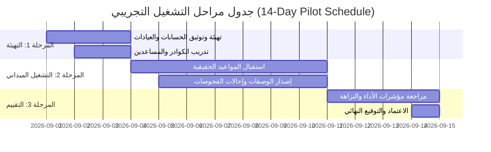

# الإجراء التشغيلي المعياري للإطلاق التجريبي المضبوط لمدة 14 يوماً
## MEDISERVICES — 14-DAY CONTROLLED CLINICAL PILOT SOP
### Operational Standard Operating Procedure & Clinical Governance

> [!WARNING]
> **الحالة الحوكمية: تم إيقاف الاعتماد والتنفيذ — وثيقة سابقة (SUPERSEDED — NOT CURRENT EXECUTION PLAN)**  
> بموجب القرار الحوكمي المعتمد بتاريخ 2026-08-23، تم **تعليق واعتبار هذه الوثيقة خطة سابقة (Superseded Plan)**.  
> **لا يُصرح بإنشاء حسابات الشريحة الموسعة أو بدء الـ 14 يوماً حتى يتم إنجاز واجتياز بوابة `PRE-PILOT ROLE & INTEGRATION GATE` بنجاح** وفق الخطة التنفيذية الحالية المعتمدة: [`medi_services_docs/sop/PRE-PILOT-ROLE-AND-INTEGRATION-VALIDATION-PLAN.md`](file:///home/yazan/Downloads/Medi/mediservices/medi_services_docs/sop/PRE-PILOT-ROLE-AND-INTEGRATION-VALIDATION-PLAN.md).

> **تنبيه رقابي وتشغيلي هام (Operational Notice):**  
> هذه الوثيقة تمثل **إجراءً تشغيلياً معيارياً (Standard Operating Procedure)** يحدد القواعد والبروتوكولات التي يجب اتباعها أثناء فترة التشغيل التجريبي الميداني للمنصة. **لا يُعتبر هذا المستند إعلاناً باكتمال فترة الـ 14 يوماً**، بل هو المرجع التشغيلي لإدارتها ومراقبتها عند انطلاقها.

---

## 1. أهداف ومواصفات شريحة التشغيل التجريبي (Pilot Cohort Scope)

* **المدة المعتمدة:** 14 يوماً تقويمياً متواصلاً.
* **شريحة المشاركين المعتمدة (Pilot Cohort):**
  - **العيادات الطبية الشريكة:** عيادتان نموذجيتان معتمدتان (عيادة طب عام وعيادة باطنية وتخصصية).
  - **الكوادر الطبية المعتمدة:** 5 أطباء ممارسين مرخصين + مساعدين اثنين.
  - **المراكز التشخيصية المساندة:** مخبر تحاليل طبية معتمد + مركز تصوير بالأشعة.
  - **نقاط الحجز المؤسسي:** مركز حجز معتمد واحد (يُمنح باقة تشغيلية تجريبية مجانية بسعة 100 حجز).

---

## 2. المراحل الزمنية لبروتوكول الأيام الـ 14 (14-Day Timeline)

### الأيام 1 إلى 3: مرحلة التفعيل والتهيئة (Onboarding & Activation)
* إنشاء حسابات الكوادر الطبية المشاركة والتحقق من التراخيص المهنية.
* ضبط جداول وساعات العيادات ومحددات الاستيعاب للمواعيد.
* إجراء جلسة تدريبية تعريفية للكوادر الطبية والمساعدين على الواجهات.

### الأيام 4 إلى 10: مرحلة التشغيل السريري الفعلي (Live Clinical Operations)
* فتح حجز المواعيد واستقبال المرضى الحقيقيين.
* توثيق العلامات الحيوية من قبل المساعدين، وإجراء الفحوصات والتشخيصات من قبل الأطباء.
* إصدار الوصفات الرقمية برمز QR والتحقق منها.
* إرسال واستقبال طلبات التحاليل والأشعة وتوثيق النتائج.

### الأيام 11 إلى 14: مرحلة التقييم ومراجعة الأداء (Evaluation & Sign-Off)
* مراجعة سجلات التدقيق السريري `clinical_access_logs` للتأكد من عدم وجود اختراقات لجدار السرية EHR.
* تدقيق سجلات الاستهلاك في جدول باقات الحجز والتأكد من مطابقة الخصومات.
* إعداد تقرير التقييم الميداني وإقرار معايير الخروج (Exit Criteria).

---

## 3. الفحوصات اليومية الإلزامية (Mandatory Daily Health Checks)

يقوم مهندس الحوكمة والتشغيل يومياً عند الساعة 08:00 صباحاً و 20:00 مساءً بالتحقق من:
1. استجابة مسار فحص الصحة `/api/v1/health` (زمن الاستجابة $< 200\text{ms}$).
2. سلامة طوابير المعالجة (Redis / Database Queue Workers) وعدم وجود وظائف فاشلة (`failed_jobs = 0`).
3. تشغيل النسخ الاحتياطي اليومي المشفر عبر `backup.sh` والتأكد من تطابق بصمة SHA-256.
4. مراجعة سجلات الأخطاء في `storage/logs/laravel.log`.

---

## 4. شروط إيقاف التشغيل التجريبي فوراً (Pilot Stop Conditions)

يتم تعليق أو إيقاف التشغيل التجريبي فوراً في الحالات التالية:
* حدوث أي حادث حرج من الدرجة الأولى (P1 Incident) مثل توقف الخادم أو تسريب معطيات.
* تسجيل أي اختراق لجدار سرية السجلات الطبية EHR أو تصعيد غير مصرح به للصلاحيات.
* فقدان أي سجل طبي أو حدوث تلف في قاعدة البيانات.
