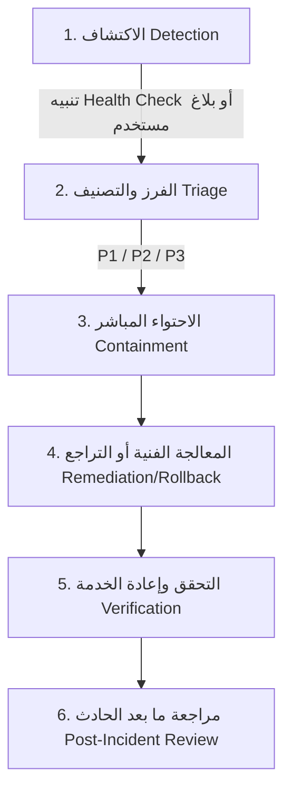

# الإجراء التشغيلي للاستجابة للحوادث وإدارة الطوارئ والتراجع الفوري
## MEDISERVICES — INCIDENT RESPONSE, TRIAGE & ROLLBACK SOP

> **تنبيه رقابي وهندسي (Engineering Notice):**  
> كافة أرقام زمن الاستجابة والتراجع المذكورة في هذه الوثيقة تُمثل **أهدافاً تشغيلية ومعايير قبول هندسية (Target Acceptance Criteria)** تخضع للاختبار الميداني والقياس المستمر.

---

## 1. تصنيف درجات خطورة الحوادث ومصفوفة الاستجابة (Severity Triage Matrix)

| الدرجة | التعريف والأمثلة | المستهدف لزمن الاستجابة (Target SLA) | الإجراء الفوري المطلوب |
|---|---|---|---|
| **`P1 — حرج (Critical)`** | توقف المنصة بالكامل، عطل في قاعدة البيانات، اختراق أمني أو تسريب بيانات سريرية. | **$< 15$ دقيقة** | إعلان حالة الطوارئ، تحويل حركة المرور إلى صفحة الصيانة، واستدعاء الفريق الفني فوراً. |
| **`P2 — رئيسي (Major)`** | تعطل خدمة الوصفة الرقمية، توقف طوابير المعالجة (Queue Stalled)، أو بطء استجابة API ($> 1\text{s}$). | **$< 1$ ساعة** | تشخيص المشكلة، إعادة تشغيل عمال Supervisor، وتطبيق معالجة سريعة (Hotfix). |
| **`P3 — ثانوي (Minor)`** | خطأ في تنسيق واجهة مستخدم، مشكلة في ترجمة نص غير سريري، أو بطء طفيف في تقرير إداري. | **$< 24$ ساعة** | توثيق التذكرة وإدراجها ضمن دورة التحديثات الدورية (Patch Release). |

---

## 2. بروتوكول الاستجابة للحوادث والاحتواء (Incident Lifecycle)



1. **الاكتشاف (Detection):** عبر مسبار `/api/v1/health`، سجلات Supervisor، أو بلاغات الكوادر الطبية.
2. **الفرز والتصنيف (Triage):** تصنيف الحادث وفق مصفوفة P1/P2/P3 وتعيين قائد الحادث (Incident Lead).
3. **الاحتواء (Containment):** عزل المكون المتأثر أو تفعيل وضع الصيانة إذا كان الحادث P1.
4. **المعالجة أو التراجع (Remediation / Rollback):** تطبيق بروتوكول التراجع الفوري أو تصحيح الخلل.
5. **التحقق (Verification):** تشغيل الفحوصات الآلية والتأكد من عودة المؤشرات للوضع الطبيعي.
6. **مراجعة ما بعد الحادث (Post-Incident Review - PIR):** كتابة تقرير الحادث الجذري وتحديد الإجراءات الوقائية.

---

## 3. بروتوكول التراجع الفوري للشيفرة المصدرية (Code Rollback Protocol)

في حال تسبب نشر تحديث برمجي جديد في خلل تشغيلي:
* **آلية التراجع الذري (Atomic Symlink Switch):**
  الاعتماد على الربط الرمزي الفوري للمجلدات المستقرة السابقة:
  ```bash
  # Target criterion: Instant symlink flip
  ln -sfn /home/yazan/Downloads/Medi/mediservices/releases/previous /home/yazan/Downloads/Medi/mediservices/current
  php artisan optimize:clear
  php artisan config:cache
  php artisan route:cache
  sudo supervisorctl restart all
  ```

---

## 4. بروتوكول التعافي واستعادة قاعدة البيانات (Database Disaster Recovery)

في حال حدوث تلف في قاعدة البيانات:
1. إيقاف خادم التطبيقات فوراً لمنع أي كتابات متضاربة.
2. استخدام سكربت الاستعادة المشفرة المعتمد:
   ```bash
   cd /home/yazan/Downloads/Medi/mediservices/infrastructure/backup
   ./restore.sh /home/yazan/Downloads/Medi/mediservices/storage/backups/backup_medical_db_YYYYMMDD_HHMMSS.sql.gz.enc
   ```
3. التحقق من مطابقة عدد الجداول (40 جدولاً) ونزاهة السجلات الطبية قبل إعادة فتح الخدمة.
