# خطة التحقق الميداني من الأدوار والتكامل البيني ومصدر الحقيقة للبيانات
# MEDISERVICES — PRE-PILOT ROLE & INTEGRATION VALIDATION PLAN
### Factual Repository Audit, Full Role Profiles, Passwords, Database Source-of-Truth, and Cross-Role Verification Protocol

---

> ### 🛑 ميثاق الحوكمة ومبدأ واقع المستودع (Mandatory Reality Governance)
> 1. **المرجعية الحاكمة:** **واقع المستودع يعلو فوق أي ادعاء نظري (`REPOSITORY REALITY > DOCUMENT CLAIM`)**.
> 2. **مصدر الحقيقة:** **قاعدة البيانات والـ Backend API هما المصدر الحصري للحقيقة للبيانات التشغيلية وهويات الأطباء والعيادات (`DATABASE / API = SINGLE SOURCE OF TRUTH`)**.
> 3. **الحالة الحوكمية للمشروع:** **`CURRENT STATUS: PRE-PILOT ROLE & INTEGRATION VALIDATION REQUIRED`**.
> 4. **تجميد خطة الـ 14 يوماً:** **خطة التشغيل التجريبي لـ 14 يوماً وحسابات الـ 100 مريض معلقة ومحظورة تماماً (`14-DAY CLINICAL PILOT: BLOCKED UNTIL PRE-PILOT GATE = PASS`)**.
> 5. **منع تزوير النتائج (Anti-Fabrication Rule):** لا يُكتب `PASS` أو `VERIFIED` لأي اختبار يدوي ما لم يتم تنفيذه بشرياً وفحص مخرجاته الفعلية وتسجيل دليله الواقعي (`EV-ROLE-xxx` / `EV-DATA-xxx`)، وتُستخدم الحالات المعتمدة حصراً: `NOT TESTED`, `READY FOR TEST`, `IN PROGRESS`, `PASS`, `FAIL`, `BLOCKED`, `NOT APPLICABLE`.
> 6. **نطاق العمل:** حساب تجريبي حقيقي واحد لكل دور فعلي مثبت في المستودع (12 حساباً تمثل الأدوار الـ 11 ومنصبي الطبيب: مدير عيادة وطبيب موظف).

---

## 1. المرحلة 1: جرد الأدوار الفعلية المثبتة في المستودع (Actual Role Inventory)

```text
========================================================================================
REPOSITORY AUDIT SUMMARY: EXACT SYSTEM ROLES & PERMISSIONS
========================================================================================
- Actual Seeded Roles Count       : EXACTLY 11 ROLES (Verified in medical_db & RoleSeeder)
- Actual Seeded Permissions Count : EXACTLY 21 PERMISSIONS
- Actual Frontend Dashboards      : EXACTLY 10 PROTECTED DASHBOARD ROUTES
- Public / Guest Landing Route    : EXACTLY 1 PUBLIC GUEST WORKFLOW
- Multi-Tenancy / 4D Dimensions   : Clinic Position (Director/Employed) & Delegation Ceilings
========================================================================================
```

---

## 2. المرحلة 2: جدول الحسابات المعتمد الموحد (Master Account Matrix)

## Master Account Matrix — Manual Account Registration & Test Credentials

| # | الدور البرمجي الدقيق (`role`) | المسمى والمنصب | الاسم الكامل | البريد الإلكتروني | رقم الهاتف | كلمة المرور المعتمدة للاختبار | Clinic / Entity | Position | Dashboard / Route | Account Status | Evidence ID |
|---|---|---|---|---|---|---|---|---|---|---|---|
| **1** | **`admin`** | المسؤول العام للمنصة | جديد لخضر | `admin@mediservices.dz` | `+213655363136` | ` Admin@Pass2026!` | المنصة المركزية | N/A | `/admin/dashboard` | READY FOR TEST | `EV-ROLE-001` |
| **2** | **`admin_assistant`** | مساعد مسؤول المنصة | قادة درافة | `val.admin.ast@mediservices.dz` | `+213550000002` | `AdmAst#Pass2026!` | المنصة المركزية | N/A | `/admin/assistant-dashboard` | READY FOR TEST | `EV-ROLE-003` |
| **3** | **`doctor`** | طبيب (مدير عيادة) | د. أحمد السعيد | `val.doctor.dir@mediservices.dz` | `+213550000003` | `Doctor#Pass2026!` | عيادة الأمل الطبية | `director` | `/doctor/dashboard` | READY FOR TEST | `EV-ROLE-004` |
| **4** | **`doctor`** | طبيب (ممارس موظف) | د. كريم منصوري | `val.doctor.emp@mediservices.dz` | `+213550000004` | `DocEmp#Pass2026!` | عيادة الأمل الطبية | `employed` | `/doctor/dashboard` | READY FOR TEST | `EV-ROLE-005` |
| **5** | **`doctor_assistant`** | مساعد طبيب / عيادة | مريم قدور | `val.assistant@mediservices.dz` | `+213550000005` | `Assist#Pass2026!` | عيادة الأمل الطبية | `assistant` | `/assistant/dashboard` | READY FOR TEST | `EV-ROLE-006` |
| **5_1** | **`doctor_assistant`** | مساعد طبيب / عيادة | فاتح محمد | `val.assistant2@mediservices.dz` | `+213555555555` | `Med#rY!NNY6Q2026!` | عيادة الأمل الطبية | `assistant` | `/assistant/dashboard` | READY FOR TEST | `EV-ROLE-007` |
| **6** | **`patient_registered`**| مريض مسجل دائم | ياسين بلقاسم | `val.patient@mediservices.dz` | `+213550000006` | `Patient#Pass2026!` | سجل المرضى | N/A | `/patient/dashboard` | READY FOR TEST | `EV-ROLE-013` |
| **7** | **`booking_center`** | مركز حجز معتمد | قادة منصور الأعرج | `val.booking@mediservices.dz` | `+213550000007` | `Booking#Pass2026!` | مركز حجز النور | N/A | `/booking/dashboard` | READY FOR TEST | `EV-ROLE-008` |
| **8** | **`lab`** | مدير مخبر تحاليل | د. توفيق الإبراهيمي | `val.lab.mgr@mediservices.dz` | `+213550000008` | `LabMgr#Pass2026!` | مخبر التحاليل المركزي | `manager` | `/laboratory/dashboard` | READY FOR TEST | `EV-ROLE-009` |
| **9** | **`lab_assistant`** | فني تحاليل مخبرية | سمير عثماني | `val.lab.tech.ass@mediservices.dz` | `+213550000009` | `LabTech#Pass2026!` | مخبر التحاليل المركزي | `technician` | `/laboratory/assistant-dashboard` | READY FOR TEST | `EV-ROLE-010` |
| **10**| **`radiology`** | مدير مركز أشعة | د. حكيم بوزيد | `val.rad.mgr@mediservices.dz` | `+213550000010` | `RadMgr#Pass2026!` | مركز التصوير الطبي | `manager` | `/radiology/dashboard` | READY FOR TEST | `EV-ROLE-011` |
| **11**| **`rad_assistant`** | فني تصوير بالأشعة | فؤاد رحموني | `val.rad.tech@mediservices.dz` | `+213550000011` | `RadTech#Pass2026!` | مركز التصوير الطبي | `technician` | `/radiology/assistant-dashboard` | READY FOR TEST | `EV-ROLE-012` |
| **12**| **`patient_guest`** | مريض زائر (مؤقت) | عمر الشريف | `val.guest@mediservices.dz` | `+213550000012` | `Guest#Pass2026!` | البوابة العامة | `guest` | `/` | READY FOR TEST | `EV-ROLE-013` |

---

## 3. المرحلة 3: بطاقات التحقق التفصيلية لكل دور (Detailed Role Dossiers)

---

### 👤 الدور 1: المسؤول العام للمنصة (`admin`)
* **معلومات الحساب:**
  - **الاسم الكامل:** مصطفى بن علي
  - **البريد:** `val.admin@mediservices.dz` | **الهاتف:** `+213550000001` | **كلمة المرور:** `Admin#Pass2026!`
  - **الدور البرمجي:** `admin` | **لوحة التحكم:** `/admin/dashboard`
* **الاختبار الإيجابي المصرح (Positive Authorization):**
  - استعراض سجلات التدقيق الجنائي للوصول السريري عبر `GET /api/v1/audit/clinical-access-logs` $
ightarrow$ تأكيد `HTTP 200 OK`.
  - مراجعة واعتماد الإعلانات الطبية عبر `GET /api/v1/advertisements` $
ightarrow$ تأكيد `HTTP 200 OK`.
* **الاختبار السلبي المحظور (Negative Authorization):**
  - محاولة تعديل أو حذف سجل تدقيق جنائي عبر `DELETE /api/v1/audit/clinical-access-logs/{id}` $
ightarrow$ تأكيد الرفض التام `HTTP 405 Method Not Allowed`.
* **سجل الدليل الرقابي:** `EV-ROLE-001` (المصادقة) | `EV-ROLE-002` (الصلاحيات)
* **حالة الاختبار:** `READY FOR TEST`

---

### 👤 الدور 2: مساعد مسؤول المنصة (`admin_assistant`)
* **معلومات الحساب:**
  - **الاسم الكامل:** سارة بلحاج
  - **البريد:** `val.admin.ast@mediservices.dz` | **الهاتف:** `+213550000002` | **كلمة المرور:** `AdmAst#Pass2026!`
  - **الدور البرمجي:** `admin_assistant` | **لوحة التحكم:** `/admin/assistant-dashboard`
* **الاختبار الإيجابي المصرح:**
  - استعراض ومتابعة الإعلانات الطبية وطلبات التعديل عبر `GET /api/v1/advertisements/my-ads` $
ightarrow$ تأكيد `HTTP 200 OK`.
* **الاختبار السلبي المحظور:**
  - محاولة الوصول لسجلات التدقيق السريري المحمية `GET /api/v1/audit/clinical-access-logs` $
ightarrow$ تأكيد الرفض `HTTP 403 Forbidden`.
* **سجل الدليل الرقابي:** `EV-ROLE-003`
* **حالة الاختبار:** `READY FOR TEST`

---

### 👤 الدور 3: طبيب - مدير عيادة (`doctor` - Position: `director`)
* **معلومات الحساب:**
  - **الاسم الكامل:** د. أحمد السعيد
  - **البريد:** `val.doctor.dir@mediservices.dz` | **الهاتف:** `+213550000003` | **كلمة المرور:** `DocDir#Pass2026!`
  - **الدور البرمجي:** `doctor` | **المنصب في العيادة:** `director` | **لوحة التحكم:** `/doctor/dashboard`
* **الربط بالكيانات (Entity Linkage):**
  - مرتبط بـ `Clinic` (عيادة الأمل الطبية) بحقل `director_doctor_id` و `doctor_clinic.position = 'director'`.
* **الاختبار الإيجابي المصرح (ما يستطيع فعله):**
  - تعديل إعدادات العيادة وساعات العمل عبر `PUT /api/v1/clinics/{id}` $
ightarrow$ تأكيد `HTTP 200 OK`.
  - إنشاء وإضافة أطباء موظفين للعيادة عبر `POST /api/v1/clinics/{id}/doctors` $
ightarrow$ تأكيد `HTTP 201 Created`.
  - إضافة مساعد وتحديد صلاحياته عبر `POST /api/v1/clinics/{id}/assistants` $
ightarrow$ تأكيد `HTTP 201 Created`.
  - تأكيد مواعيد مركز الحجز واقتطاع الحصة الذري عبر `POST /api/v1/appointments/{id}/confirm` $
ightarrow$ تأكيد `HTTP 200 OK`.
  - الممارسة الكلينيكية الكاملة: فتح زيارة، كتابة تشخيص، إصدار وصفات، طلب تحاليل وأشعة.
* **الاختبار السلبي المحظور (ما لا يستطيع فعله):**
  - محاولة تفويض صلاحيات محظورة للمساعد (مثل كتابة الوصفة) $
ightarrow$ تجريد الصلاحية آلياً عبر محرك الصلاحيات (Sanitization Ceiling).
  - محاولة تعديل إعدادات أو قراءة ملفات عيادة طبية أخرى.
* **سجل الدليل الرقابي:** `EV-ROLE-004`
* **حالة الاختبار:** `READY FOR TEST`

---

### 👤 الدور 4: طبيب - ممارس موظف (`doctor` - Position: `employed`)
* **معلومات الحساب:**
  - **الاسم الكامل:** د. كريم منصوري
  - **البريد:** `val.doctor.emp@mediservices.dz` | **الهاتف:** `+213550000004` | **كلمة المرور:** `DocEmp#Pass2026!`
  - **الدور البرمجي:** `doctor` | **المنصب في العيادة:** `employed` (بالمستودع `doctor_clinic.position = 'doctor'`)
  - **لوحة التحكم:** `/doctor/dashboard`
* **الربط بالكيانات (Entity Linkage):**
  - مسجل في جدول `doctors` برقم اعتماد وطني `DZ-ALG-VAL-EMP01`.
  - مرتبط بـ `Clinic` (عيادة الأمل الطبية) عبر جدول الربط `doctor_clinic` مع `position = 'doctor'` و `is_primary = true`.
  - معرف الطبيب: `Doctor ID` | معرف العيادة: `Clinic ID`.
  - التخصص: `طب عام (General Medicine)` أو `أمراض القلب (Cardiology)`.
* **صلاحيات الطبيب الموظف (ما يستطيع فعله):**
  - استقبال المرضى المجدولين له في العيادة وإجراء الكشف الكلينيكي.
  - فتح زيارة سريرية وكتابة الفحص والتشخيص وقفلها عبر `POST /api/v1/clinical-visits/{id}/finalize` $
ightarrow$ تأكيد `HTTP 200 OK`.
  - إصدار وصفة رقمية برمز QR عبر `POST /api/v1/prescriptions` $
ightarrow$ تأكيد `HTTP 201 Created`.
  - حفظ واسترجاع قوالب الوصفات الشخصية عبر `GET /api/v1/prescriptions/templates` $
ightarrow$ تأكيد `HTTP 200 OK`.
  - طلب التحاليل المخبرية والأشعة التشخيصية لمرضاه.
* **القيود الصارمة (ما لا يستطيع فعله):**
  - **محظور من تعديل إعدادات العيادة:** محاولة `PUT /api/v1/clinics/{id}` $
ightarrow$ حظر صارم `HTTP 403 Forbidden`.
  - **محظور من إضافة أو تعديل أطباء العيادة:** محاولة `POST /api/v1/clinics/{id}/doctors` $
ightarrow$ حظر صارم `HTTP 403 Forbidden`.
  - **محظور من إدارة أو تعيين المساعدين:** محاولة `POST /api/v1/clinics/{id}/assistants` $
ightarrow$ حظر صارم `HTTP 403 Forbidden`.
  - **محظور من تعديل ساعات عمل العيادة العامة.**
  - **محظور من الوصول لملفات وملاحظات مرضى عيادات أخرى (EHR Privacy Wall).**
* **سجل الدليل الرقابي:** `EV-ROLE-005` | `EV-DATA-003`
* **حالة الاختبار:** `READY FOR TEST`

---

### 👤 الدور 5: مساعد طبيب / عيادة (`doctor_assistant`)
* **معلومات الحساب:**
  - **الاسم الكامل:** مريم قدور
  - **البريد:** `val.assistant@mediservices.dz` | **الهاتف:** `+213550000005` | **كلمة المرور:** `Assist#Pass2026!`
  - **الدور البرمجي:** `doctor_assistant` | **لوحة التحكم:** `/assistant/dashboard`
* **الربط بالكيانات:**
  - مرتبط بـ `ClinicAssistant` في عيادة الأمل بصلاحيات مفوضة: `record_vitals`, `manage_queue`.
* **الاختبار الإيجابي المصرح:**
  - تسجيل حضور المريض وإدخال العلامات الحيوية عبر `POST /api/v1/clinical-visits/{id}/vital-signs` $
ightarrow$ تأكيد `HTTP 200 OK`.
* **الاختبار السلبي المحظور:**
  - محاولة إصدار وصفة طبية `POST /api/v1/prescriptions` $
ightarrow$ تأكيد الرفض `HTTP 403 Forbidden`.
  - محاولة تأكيد موعد لاقتطاع حصة باقة `POST /api/v1/appointments/{id}/confirm` $
ightarrow$ تأكيد الرفض `HTTP 403 Forbidden`.
  - محاولة قراءة التشخيص والملاحظات السريرية السرية للزيارة $
ightarrow$ حجب الحقول السرية عبر جدار السرية EHR.
* **سجل الدليل الرقابي:** `EV-ROLE-006`
* **حالة الاختبار:** `READY FOR TEST`

---

### 👤 الدور 6: مريض مسجل دائم (`patient_registered`)
* **معلومات الحساب:**
  - **الاسم الكامل:** ياسين بلقاسم
  - **البريد:** `val.patient@mediservices.dz` | **الهاتف:** `+213550000006` | **كلمة المرور:** `Patient#Pass2026!`
  - **الدور البرمجي:** `patient_registered` | **لوحة التحكم:** `/patient/dashboard`
* **الربط بالكيانات:**
  - مرتبط بـ `Patient` برقم ملف طبي تسلسلي `MRN-2026-VAL01`.
* **الاختبار الإيجابي المصرح:**
  - استعراض ملفه الطبي الشخصي والحساسيات عبر `GET /api/v1/patients/{id}` $
ightarrow$ تأكيد `HTTP 200 OK`.
  - حجز موعد لنفسه بالساعة عبر `POST /api/v1/appointments` $
ightarrow$ تأكيد `HTTP 201 Created`.
* **الاختبار السلبي المحظور:**
  - محاولة استعراض أو تعديل ملف مريض آخر `GET /api/v1/patients/{other_id}` $
ightarrow$ تأكيد الرفض `HTTP 403 Forbidden`.
  - محاولة استعراض نتائج تحاليل أو أشعة مسودة قبل اعتمادها $
ightarrow$ تأكيد الرفض `HTTP 403 Forbidden` (Draft Privacy Scoping).
* **سجل الدليل الرقابي:** `EV-ROLE-007`
* **حالة الاختبار:** `READY FOR TEST`

---

### 👤 الدور 7: مركز حجز معتمد (`booking_center`)
* **معلومات الحساب:**
  - **الاسم الكامل:** مركز النور للحجز
  - **البريد:** `val.booking@mediservices.dz` | **الهاتف:** `+213550000007` | **كلمة المرور:** `Booking#Pass2026!`
  - **الدور البرمجي:** `booking_center` | **لوحة التحكم:** `/booking/dashboard`
* **الربط بالكيانات:**
  - مرتبط بـ `BookingCenter` وباقة حجز عمليات `BookingPackage (PKG_100)`.
* **الاختبار الإيجابي المصرح:**
  - شراء باقة عمليات وشحن الرصيد عبر `POST /api/v1/booking-centers/purchase-package` $
ightarrow$ تأكيد إضافة 100 وحدة.
  - استعلام رصيد الحصص وسجل الحركات عبر `GET /api/v1/booking-centers/quota-balance` $
ightarrow$ تأكيد `HTTP 200 OK`.
  - حجز موعد لمريض بالعيادة عبر `POST /api/v1/appointments` $
ightarrow$ تأكيد حالة `pending` دون خصم مبكر.
* **الاختبار السلبي المحظور:**
  - محاولة الوصول لتفاصيل الزيارات السريرية أو تشخيصات المرضى `GET /api/v1/clinical-visits` $
ightarrow$ تأكيد الرفض `HTTP 403 Forbidden`.
  - محاولة إدارة طاقم العيادات `POST /api/v1/clinics/{id}/assistants` $
ightarrow$ تأكيد الرفض `HTTP 403 Forbidden`.
* **سجل الدليل الرقابي:** `EV-ROLE-008`
* **حالة الاختبار:** `READY FOR TEST`

---

### 👤 الدور 8: مدير مخبر تحاليل (`lab`)
* **معلومات الحساب:**
  - **الاسم الكامل:** د. توفيق الإبراهيمي
  - **البريد:** `val.lab.mgr@mediservices.dz` | **الهاتف:** `+213550000008` | **كلمة المرور:** `LabMgr#Pass2026!`
  - **الدور البرمجي:** `lab` | **لوحة التحكم:** `/laboratory/dashboard`
* **الربط بالكيانات:**
  - مرتبط بـ `DiagnosticCenter (type: laboratory)` (مخبر التحاليل الدقيقة المركزي).
* **الاختبار الإيجابي المصرح:**
  - استعراض طلبات التحاليل المحالة للمخبر عبر `GET /api/v1/diagnostic-orders` $
ightarrow$ تأكيد `HTTP 200 OK`.
  - إضافة وتعيين فني مخبر عبر `POST /api/v1/diagnostic-centers/{id}/staff` $
ightarrow$ تأكيد `HTTP 201 Created`.
  - مراجعة واعتماد النتائج المخبرية نهائياً والإفراج عنها عبر `POST /api/v1/diagnostic-orders/{id}/finalize` $
ightarrow$ تأكيد `HTTP 200 OK`.
* **الاختبار السلبي المحظور:**
  - محاولة الوصول لطلبات مركز أشعة غير مرتبط به $
ightarrow$ تأكيد الرفض `HTTP 403 Forbidden`.
* **سجل الدليل الرقابي:** `EV-ROLE-009`
* **حالة الاختبار:** `READY FOR TEST`

---

### 👤 الدور 9: فني تحاليل مخبرية (`lab_assistant`)
* **معلومات الحساب:**
  - **الاسم الكامل:** سمير عثماني
  - **البريد:** `val.lab.tech@mediservices.dz` | **الهاتف:** `+213550000009` | **كلمة المرور:** `LabTech#Pass2026!`
  - **الدور البرمجي:** `lab_assistant` | **لوحة التحكم:** `/laboratory/assistant-dashboard`
* **الربط بالكيانات:**
  - مسجل في `DiagnosticStaff` كفني (`technician`) في مخبر التحاليل.
* **الاختبار الإيجابي المصرح:**
  - تسجيل استلام العينات عبر `POST /api/v1/diagnostic-orders/{id}/samples` $
ightarrow$ تأكيد `HTTP 201 Created`.
  - إدخال قيم الفحوصات كمسودة عبر `POST /api/v1/diagnostic-order-items/{id}/result` $
ightarrow$ تأكيد `HTTP 200 OK`.
* **الاختبار السلبي المحظور:**
  - محاولة اعتماد النتائج نهائياً `POST /api/v1/diagnostic-orders/{id}/finalize` $
ightarrow$ تأكيد الرفض `HTTP 403 Forbidden` (خاص بمدير المخبر).
* **سجل الدليل الرقابي:** `EV-ROLE-010`
* **حالة الاختبار:** `READY FOR TEST`

---

### 👤 الدور 10: مدير مركز أشعة (`radiology`)
* **معلومات الحساب:**
  - **الاسم الكامل:** د. حكيم بوزيد
  - **البريد:** `val.rad.mgr@mediservices.dz` | **الهاتف:** `+213550000010` | **كلمة المرور:** `RadMgr#Pass2026!`
  - **الدور البرمجي:** `radiology` | **لوحة التحكم:** `/radiology/dashboard`
* **الربط بالكيانات:**
  - مرتبط بـ `DiagnosticCenter (type: radiology)` (مركز التصوير الطبي المتطور).
* **الاختبار الإيجابي المصرح:**
  - استعراض طلبات التصوير الإشعاعي عبر `GET /api/v1/diagnostic-orders` $
ightarrow$ تأكيد `HTTP 200 OK`.
  - اعتماد ونشر التقرير الطبي الإشعاعي النهائي عبر `POST /api/v1/radiology-reports/{id}/finalize` $
ightarrow$ تأكيد `HTTP 200 OK`.
* **الاختبار السلبي المحظور:**
  - محاولة تعديل إعدادات مخبر تحاليل آخر $
ightarrow$ تأكيد الرفض `HTTP 403 Forbidden`.
* **سجل الدليل الرقابي:** `EV-ROLE-011`
* **حالة الاختبار:** `READY FOR TEST`

---

### 👤 الدور 11: فني تصوير بالأشعة (`rad_assistant`)
* **معلومات الحساب:**
  - **الاسم الكامل:** فؤاد رحموني
  - **البريد:** `val.rad.tech@mediservices.dz` | **الهاتف:** `+213550000011` | **كلمة المرور:** `RadTech#Pass2026!`
  - **الدور البرمجي:** `rad_assistant` | **لوحة التحكم:** `/radiology/assistant-dashboard`
* **الربط بالكيانات:**
  - مسجل في `DiagnosticStaff` كفني (`technician`) في مركز الأشعة.
* **الاختبار الإيجابي المصرح:**
  - تسجيل إتمام جلسة التصوير وإدخال التقرير الفني المبدئي عبر `POST /api/v1/diagnostic-orders/{id}/radiology-report` $
ightarrow$ تأكيد `HTTP 201 Created`.
* **الاختبار السلبي المحظور:**
  - محاولة اعتماد التقرير الطبي الإشعاعي النهائي `POST /api/v1/radiology-reports/{id}/finalize` $
ightarrow$ تأكيد الرفض `HTTP 403 Forbidden`.
* **سجل الدليل الرقابي:** `EV-ROLE-012`
* **حالة الاختبار:** `READY FOR TEST`

---

### 👤 الدور 12: مريض زائر مؤقت (`patient_guest`)
* **معلومات الحساب:**
  - **الاسم الكامل:** عمر الشريف
  - **البريد:** `val.guest@mediservices.dz` | **الهاتف:** `+213550000012` | **كلمة المرور:** `Guest#Pass2026!`
  - **الدور البرمجي:** `patient_guest` | **المسار المستهدف:** `/` (صفحة الهبوط / حجز المواعيد العامة)
* **الاختبار الإيجابي المصرح:**
  - استعلام الساعات المتاحة للأطباء والعيادات عبر `GET /api/v1/appointments/slots` $
ightarrow$ تأكيد `HTTP 200 OK`.
  - حجز موعد مؤقت برمز تحقق عبر `POST /api/v1/appointments` $
ightarrow$ تأكيد `HTTP 201 Created`.
  - التحقق من صلاحية الوصفة الرقمية عبر الرابط العام `GET /api/v1/v/{token}` $
ightarrow$ تأكيد `HTTP 200 OK`.
* **الاختبار السلبي المحظور:**
  - محاولة الدخول للوحات التحكم المحمية `/doctor/dashboard` أو `/patient/dashboard` دون تسجيل $
ightarrow$ إعادة التوجيه لصفحة تسجيل الدخول `HTTP 401 Unauthorized`.
* **سجل الدليل الرقابي:** `EV-ROLE-013`
* **حالة الاختبار:** `READY FOR TEST`

---

## 4. المرحلة 4: التحقق من مصدر الحقيقة للبيانات (Database Source-of-Truth Validation — Doctor & Clinic Data)

### الهدف المنهجي
إثبات وتوثيق أن جميع بيانات وهوية:
- **الطبيب (Doctor Name & ID)**
- **التخصص الدقيق (Specialty)**
- **العيادة (Clinic Name & ID)**
- **المنصب (Position: Director vs Employed)**
- **البيانات المهنية والاتصالية**

يتم جلبها واستخراجها فعلياً وتدفقها عبر المسار الهندسي الكامل:
```text
┌────────────────────────────────────────┐
│  DATABASE (MySQL / Eloquent Schema)    │
└──────────────────┬─────────────────────┘
                   │
                   ▼
┌────────────────────────────────────────┐
│  BACKEND / REST API (Sanctum Payload)  │
└──────────────────┬─────────────────────┘
                   │
                   ▼
┌────────────────────────────────────────┐
│  FRONTEND (React UI Context / Dashboard)│
└────────────────────────────────────────┘
```
**ومنع أي اعتماد على:**
- Hard-coded runtime strings.
- Static mock fixtures كمصدر تشغيلي.
- بيانات fallback تستبدل بيانات المستخدم المصادق عليه.
- اختلاط بيانات طبيب مع طبيب آخر.

---

### 🔬 السيناريو 1: التحقق من الطبيب المرجعي د. أحمد السعيد (`SCN-DATA-DOCTOR-001`)

* **الحساب المرجعي:** `val.doctor.dir@mediservices.dz` (د. أحمد السعيد - مدير عيادة).
* **بروتوكول الخطوات الـ 12 الإلزامي:**
  1. تسجيل الدخول بالنظام عبر `POST /api/v1/auth/login` بحساب `val.doctor.dir@mediservices.dz`.
  2. استخراج الـ User UUID والـ Doctor UUID من الـ Token المصادق عليه.
  3. استخراج الـ Clinic UUID المرتبط من جدول `doctor_clinic` حيث `position = 'director'`.
  4. قراءة سجل الطبيب المباشر من قاعدة البيانات: `SELECT * FROM doctors WHERE user_id = ?`.
  5. قراءة سجل العيادة المباشر من قاعدة البيانات: `SELECT * FROM clinics WHERE director_doctor_id = ?`.
  6. قراءة التخصص المعتمد من عمود `specialty` في جدول `doctors`.
  7. التحقق من عمود `position = 'director'` في جدول `doctor_clinic`.
  8. استدعاء استجابة الـ Backend API: `GET /api/v1/auth/me` و `GET /api/v1/clinics/onboarding-status`.
  9. فتح لوحة تحكم الطبيب في المتصفح `/ar/doctor/dashboard`.
  10. مقارنة نصوص وقيم الواجهة المعروضة في شريط الرأس وبطاقة العيادة مع استجابة الـ API.
  11. مقارنة استجابة الـ API مع القيم الفعلية المخزنة في قاعدة البيانات.
  12. التحقق من تحقق المعادلة الحاكمة: **`Database Value == API Value == Frontend Value`**.

---

## Doctor Data Source Verification — Dr. Ahmed Al-Saeed

| Field | Database Value | API Value | Frontend Value | Match | Status | Evidence ID |
|---|---|---|---|---|---|---|
| **Doctor ID** | *(Read from `doctors.id`)* | *(Read from `data.doctor.id`)* | *(Read from UI State)* | *(Pending)* | **READY FOR TEST** | `EV-DATA-002` |
| **Doctor Name** | *(Read from `users.name`)* | *(Read from `data.user.name`)* | *(Read from Header)* | *(Pending)* | **READY FOR TEST** | `EV-DATA-002` |
| **Specialty** | *(Read from `doctors.specialty`)* | *(Read from `data.doctor.specialty`)* | *(Read from Subtitle)* | *(Pending)* | **READY FOR TEST** | `EV-DATA-002` |
| **Clinic ID** | *(Read from `clinics.id`)* | *(Read from `affiliation.id`)* | *(Read from Context)* | *(Pending)* | **READY FOR TEST** | `EV-DATA-002` |
| **Clinic Name** | *(Read from `clinics.name`)* | *(Read from `data.clinic.name`)* | *(Read from Banner)* | *(Pending)* | **READY FOR TEST** | `EV-DATA-002` |
| **Clinic Position** | *(Read from `doctor_clinic.position`)* | *(Read from `affiliation.is_director`)* | *(Read from Director Badge)* | *(Pending)* | **READY FOR TEST** | `EV-DATA-002` |
| **Account Email** | *(Read from `users.email`)* | *(Read from `data.user.email`)* | *(Read from Settings)* | *(Pending)* | **READY FOR TEST** | `EV-DATA-002` |

---

### 🔬 السيناريو 2: التحقق من الطبيب الموظف د. كريم منصوري (`SCN-DATA-DOCTOR-002`)

* **الحساب المرجعي:** `val.doctor.emp@mediservices.dz` (د. كريم منصوري - طبيب ممارس موظف).
* **بروتوكول التحقق:**
  1. تسجيل الدخول بحساب `val.doctor.emp@mediservices.dz`.
  2. التحقق من ربط الطبيب بالعيادة عبر جدول `doctor_clinic` مع `position = 'doctor'` (Employed).
  3. التأكد من أن استجابة `GET /api/v1/clinics/onboarding-status` ترجع `is_director = false`.
  4. فتح لوحة تحكم الطبيب `/ar/doctor/dashboard` والتحقق من:
     - ظهور شارة "طبيب ممارس موظف" (وليس مدير العيادة).
     - حجب أزرار إدارة العيادة وإضافة الطاقم.
     - ظهور اسم د. كريم منصوري وتخصصه الخاص دون أي ظهور لبيانات د. أحمد السعيد.
  5. التحقق من مطابقة: `Database == API == Frontend`.
* **سجل الدليل الرقابي:** `EV-DATA-003` | **الحالة:** `READY FOR TEST`

---

### 🔬 السيناريو 3: بروتوكول عزل هوية وبيانات الأطباء (`SCN-DATA-ISOLATION-001`)

* **الهدف:** إثبات الاستقلال التام والمنع القاطع لأي تسريب أو اختلاط في الجلسات بين الطبيب المدير والطبيب الموظف.
* **تسلسل الاختبار الإلزامي:**
  ```text
  [1. تسجيل دخول: د. أحمد السعيد (Director)]
          ↓
  [التحقق: ظهور بيانات أحمد السعيد + عيادة الأمل + شارة المدير]
          ↓
  [2. تسجيل الخروج الكامل: POST /api/v1/auth/logout]
          ↓
  [3. تسجيل دخول فوري: د. كريم منصوري (Employed)]
          ↓
  [التحقق: ظهور بيانات كريم منصوري حصراً + اختفاء شارة المدير + عدم ظهور اسم أحمد السعيد في أي تبويب]
          ↓
  [4. تسجيل الخروج الكامل: POST /api/v1/auth/logout]
          ↓
  [5. إعادة تسجيل الدخول: د. أحمد السعيد (Director)]
          ↓
  [التحقق: عودة صلاحيات المدير واستعادة سياق أحمد السعيد كاملاً]
  ```
* **معيار الحكم (Verdict):** أي بقاء لـ Cache أو اسم أو معرف أو صلاحية من الطبيب السابق في جلسة الطبيب اللاحق = **`FAIL` فوري**.
* **سجل الدليل الرقابي:** `EV-DATA-004` | **الحالة:** `READY FOR TEST`

---

### 🔬 السيناريو 4: ثبات الهوية الكلينيكية عبر اللغات الثلاث (`SCN-DATA-I18N-001`)

* **الهدف:** التأكد من أن تبديل لغة الواجهة بين العربية والإنجليزية والفرنسية يترجم عناصر التحكم وعناوين التبويبات فقط، ولا يؤثر إطلاقاً على هوية الطبيب واسم العيادة والتخصص المستخرجين من قاعدة البيانات.
* **مسار التحقق:**
  ```text
  /ar/doctor/dashboard ──▶ /en/doctor/dashboard ──▶ /fr/doctor/dashboard ──▶ /ar/doctor/dashboard
  ```
* **الحقول الواجب بقاؤها مطابقة لقاعدة البيانات:**
  - اسم الطبيب: د. أحمد السعيد / Dr. Ahmed Al-Saeed
  - اسم العيادة: عيادة الأمل الطبية
  - المعرفات: `Doctor UUID` و `Clinic UUID`
  - المنصب: `director` / `employed`
* **معيار الحكم:** أي تغير أو فقدان لهوية الطبيب أو العيادة بسبب تغيير اللغة = **`FAIL`**.
* **سجل الدليل الرقابي:** `EV-DATA-005` | **الحالة:** `READY FOR TEST`

---

### 🔬 السيناريو 5: تدقيق واستبعاد البيانات الثابتة (Static / Hard-coded Data Audit)

* **الهدف:** فحص شفرة الواجهة ومكونات لوحة الطبيب لضمان الاعتماد الحصري على Hooks وبيانات الـ API الحية وعدم استخدام قيم ثابتة أو Fallback تجريبي في بيئة التشغيل.
* **التمييز المنهجي:**
  - `TEST FIXTURES / SEEDERS`: مسموحة ومطلوبة لاختبارات الـ Unit/Feature في بيئة الاختبار.
  - `RUNTIME DATA`: محظور تماماً أن تعتمد على Hardcoded fallback في الواجهة الإنتاجية.
* **سجل الدليل الرقابي:** `EV-DATA-001` | **الحالة:** `READY FOR TEST`

---

### 🔬 السيناريو 6: فحص التكامل العلائقي لقاعدة البيانات (Database Relational Integrity Audit)

* **الاستعلامات الرقابية الحاكمة:**
  1. التحقق من سلامة علاقات الأطباء بالعيادات:
     `SELECT d.id, u.name, dc.clinic_id, c.name, dc.position FROM doctors d JOIN users u ON d.user_id = u.id LEFT JOIN doctor_clinic dc ON d.id = dc.doctor_id LEFT JOIN clinics c ON dc.clinic_id = c.id;`
  2. التأكد من انعدام الأطباء المعلقين بدون حسابات مستخدمين (`No Orphan Doctors`):
     `SELECT * FROM doctors WHERE user_id NOT IN (SELECT id FROM users);`
  3. التأكد من انعدام العيادات بدون مدراء معتمدين (`No Orphan Clinics`):
     `SELECT * FROM clinics WHERE director_doctor_id NOT IN (SELECT id FROM doctors);`
  4. التأكد من عدم وجود أكثر من منصب نشط متضارب لنفس الطبيب في نفس العيادة.
* **سجل الدليل الرقابي:** `EV-DATA-006` | **الحالة:** `READY FOR TEST`

---

## 5. المرحلة 5: بروتوكول التحقق من مسارات التكامل البيني (Cross-Role Integration Protocol)

يجب اختبار **5 مسارات تكامل حقيقية** تربط بين الحسابات اليدوية الـ 12 السابقة:

```mermaid
flowchart TD
    subgraph WF1[مسار 1: الرعاية السريرية الكاملة والوصفة]
        P1[1. المريض: حجز موعد] --> A1[2. المساعد: تسجيل الحضور والعلامات الحيوية]
        A1 --> D1[3. الطبيب: الفحص وكتابة التشخيص وقفل الزيارة]
        D1 --> RX1[4. الطبيب: إصدار وصفة رقمية برمز QR]
        RX1 --> V1[5. الصيدلي/المريض: التحقق الفوري من رمز QR]
    end

    subgraph WF2[مسار 2: الحجز المؤسسي واقتطاع الحصص]
        BC2[1. مركز الحجز: شراء باقة 100] --> BOK2[2. مركز الحجز: حجز موعد لمريض]
        BOK2 --> DOC2[3. الطبيب: تأكيد الموعد -> خصم ذري 1 وحدة]
        DOC2 --> CAN2[4. الطبيب: إلغاء الموعد -> استرجاع ذري 1 وحدة]
    end

    subgraph WF3[مسار 3: التحاليل المخبرية وجدار سرية المسودة]
        DOC3[1. الطبيب: طلب تحليل دم] --> TECH3[2. فني المخبر: استلام العينة وإدخال نتيجة مسودة]
        TECH3 -.->|حجب المسودة عن الطبيب والمريض| PRIV3[جدار سرية المسودات]
        TECH3 --> MGR3[3. مدير المخبر: مراجعة واعتماد النتيجة]
        MGR3 --> REL3[4. الإفراج: إتاحة النتيجة في ملف المريض EHR]
    end
```



---

## 6. المرحلة 6: هيكل وسجل الأدلة الميدانية المعتمد (Evidence Registry Schema)

```text
========================================================================================
PRE-PILOT EVIDENCE REGISTRY SCHEMA (EV-ROLE-xxx / EV-DATA-xxx)
========================================================================================
- Evidence ID        : EV-ROLE-xxx / EV-DATA-xxx (e.g. EV-DATA-002)
- Execution Date     : YYYY-MM-DD
- Execution Time     : HH:MM:SS UTC+1
- Tester Name        : Senior QA Engineer Name
- Pilot Account ID   : MAN-DOC-01 / MAN-PAT-01 / etc.
- Role Key           : doctor / clinic_director / employed_doctor
- Scenario ID        : SCN-DATA-DOCTOR-001 / SCN-DATA-ISOLATION-001 / SCN-AUTH-03
- Action Executed    : e.g. GET /api/v1/clinics/onboarding-status
- Expected Result    : Database == API == Frontend identity match
- Actual Result      : Detailed empirical observation
- HTTP Status Code   : 200 / 201 / 401 / 403 / 422
- DB Reference       : e.g. doctors.id = 01a02d..., clinics.id = 01a02e...
- Audit Reference    : e.g. clinical_access_logs.id = 01a02f...
- Human Verification : Verified by Senior Test Engineer (Signature / Initials)
- Verdict            : NOT TESTED / READY FOR TEST / PASS / FAIL / BLOCKED
- Notes / Remarks    : Detailed behavioral observations
========================================================================================
```

### سجل الأدلة الإلزامية (Master Evidence Registry)

| Evidence ID | Scope & Target Scenario | Associated Account | Expected Verification | Status |
|---|---|---|---|---|
| `EV-ROLE-001` | Platform Admin Authentication | `val.admin@mediservices.dz` | Login & Session Token Verification | **READY FOR TEST** |
| `EV-ROLE-002` | Platform Admin Audit Authorization | `val.admin@mediservices.dz` | Clinical Access Logs View (`200 OK`) | **READY FOR TEST** |
| `EV-ROLE-003` | Admin Assistant Ad Review | `val.admin.ast@mediservices.dz` | Ad Review (`200 OK`) & Audit Block (`403`) | **READY FOR TEST** |
| `EV-ROLE-004` | Doctor Director Full Authority | `val.doctor.dir@mediservices.dz` | Clinic Settings, Staff Addition, Confirmation | **READY FOR TEST** |
| `EV-ROLE-005` | Employed Doctor Authority | `val.doctor.emp@mediservices.dz` | Clinical Exam & Prescription (`200`), Settings Block (`403`) | **READY FOR TEST** |
| `EV-ROLE-006` | Doctor Assistant Delegation | `val.assistant@mediservices.dz` | Vitals & Queue (`200`), Rx Block (`403`) | **READY FOR TEST** |
| `EV-ROLE-007` | Registered Patient EHR Access | `val.patient@mediservices.dz` | Personal EHR View (`200`), Other Patient Block (`403`) | **READY FOR TEST** |
| `EV-ROLE-008` | Booking Center Quota Lifecycle | `val.booking@mediservices.dz` | Package Purchase & Atomic Deduction | **READY FOR TEST** |
| `EV-ROLE-009` | Laboratory Manager Release | `val.lab.mgr@mediservices.dz` | Diagnostic Finalization & Staff Assign | **READY FOR TEST** |
| `EV-ROLE-010` | Lab Technician Draft Entry | `val.lab.tech@mediservices.dz` | Sample Intake & Draft Privacy Enforcement | **READY FOR TEST** |
| `EV-ROLE-011` | Radiology Manager Release | `val.rad.mgr@mediservices.dz` | DICOM Report Finalization & Publication | **READY FOR TEST** |
| `EV-ROLE-012` | Radiology Technician Intake | `val.rad.tech@mediservices.dz` | Session Intake & Draft Entry (`201 Created`) | **READY FOR TEST** |
| `EV-ROLE-013` | Guest Patient Appointment | `val.guest@mediservices.dz` | Public Slot Query & Token Verification | **READY FOR TEST** |
| `EV-DATA-001` | Static / Hard-coded Audit | Codebase / Components | Ensure zero hardcoded runtime identities | **READY FOR TEST** |
| `EV-DATA-002` | Dr. Ahmed Al-Saeed Source-of-Truth | `val.doctor.dir@mediservices.dz` | Verify DB == API == Frontend (6 Fields) | **READY FOR TEST** |
| `EV-DATA-003` | Dr. Karim Mansouri Source-of-Truth | `val.doctor.emp@mediservices.dz` | Verify DB == API == Frontend (Employed) | **READY FOR TEST** |
| `EV-DATA-004` | Doctor Identity & Session Isolation | Dir ↔ Emp Alternation | Verify zero session/cache contamination | **READY FOR TEST** |
| `EV-DATA-005` | Trilingual Identity Invariance | AR ↔ EN ↔ FR | Verify identity invariance during locale switch | **READY FOR TEST** |
| `EV-DATA-006` | Database Relational Integrity | MySQL Relational Schema | Zero orphan records and zero position conflicts | **READY FOR TEST** |

---

## 7. المرحلة 7: بوابة الاعتماد التمهيدية الإلزامية (PRE-PILOT ACCEPTANCE GATE)

```text
========================================================================================
PRE-PILOT ROLE, DATA & INTEGRATION GATE CRITERIA (MANDATORY)
========================================================================================
[ ] 1. All 11 actual system roles factually audited and mapped (Role Inventory locked).
[ ] 2. Exactly one real manual account created and documented for every actual role (12 accounts).
[ ] 3. Authentication & Session revocation 100% verified for all 12 accounts.
[ ] 4. Positive Authorization 100% verified across all core role operations.
[ ] 5. Negative Authorization & Boundary Protection (Strict 403) 100% verified.
[ ] 6. Cross-Role Workflows (WF-INT-01 to WF-INT-05) 100% verified end-to-end.
[ ] 7. Data Isolation, EHR Privacy Wall, and Draft Privacy Scoping 100% verified.
[ ] 8. Database Source-of-Truth verified for doctor and clinic data (Database -> API -> Frontend).
[ ] 9. Dr. Ahmed Al-Saeed (Director) data verified: Database = API = Frontend (6 Core Fields).
[ ] 10. Employed Doctor account (Dr. Karim Mansouri) verified and linked to correct clinic with position: employed.
[ ] 11. Doctor identity and session isolation verified between Director and Employed Doctor with zero state leakage.
[ ] 12. Specialty and Clinic data are verified to be live runtime values from DB/API, not hard-coded fallbacks.
[ ] 13. Language switching (AR / EN / FR) verified to preserve exact doctor and clinic identity data.
[ ] 14. Database Relational Integrity verified with zero orphan records and zero foreign key violations.
[ ] 15. Complete Evidence Registry (EV-ROLE-001..013, EV-DATA-001..006) fully populated with real empirical test runs.
[ ] 16. Human Verification signed off by Lead QA Engineer and Medical Director.

GATE DECISION:
- IF ALL 16 CRITERIA ARE SATISFIED : GATE STATUS = PASS ✅
  --> Authorized to proceed to 14-Day Clinical Pilot Preparation.
- IF ANY CRITICAL FAILURE OCCURS   : GATE STATUS = BLOCKED 🛑
  --> 14-Day Clinical Pilot execution remains strictly forbidden and halted.
========================================================================================
```
