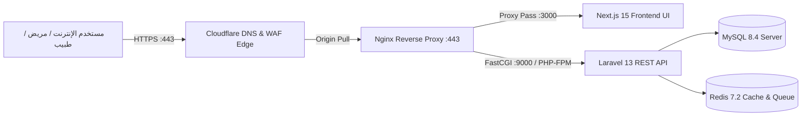

# الإجراء التشغيلي لربط النطاق العام وتفعيل شهادات الأمان SSL
## MEDISERVICES — PUBLIC DNS, SSL/TLS & GO-LIVE BINDING SOP

> **تنبيه حوكمي وتشغيلي هام (Governance Invariant):**  
> هذه الوثيقة تمثل **إجراءً تشغيلياً قياسياً (SOP Blueprint)** لخطوات توجيه الدومين وإعداد الشهادات عند موعد الإطلاق الفعلي. **لا يتم تنفيذ أي تغيير في الـ DNS العام أو تعديل البنية التحتية الفعلية خارج البيئة المصرح بها في هذه الخطوة**.

---

## 1. البنية المعمارية لتوجيه النطاق (Public DNS Architecture)



---

## 2. خطوات توجيه النطاق العام (Public DNS Configuration)

| اسم السجل (Record Name) | النوع (Type) | الوجهة (Target / Origin IP) | حالة الحماية (Proxy Status) |
|---|---|---|---|
| `@` (`mediservices.dz`) | `A` | `YOUR_PRODUCTION_SERVER_IP` | `Proxied (Cloudflare Orange Cloud)` |
| `www` | `CNAME` | `mediservices.dz` | `Proxied` |
| `api` (`api.mediservices.dz`) | `CNAME` | `mediservices.dz` | `Proxied` |

---

## 3. إعداد شهادات الأمان والتشفير (SSL/TLS Provisioning Protocol)

1. **تشفير Let's Encrypt على خادم الإنتاج Nginx:**
   ```bash
   # Execute on production server during Go-Live maintenance window
   sudo certbot --nginx -d mediservices.dz -d www.mediservices.dz -d api.mediservices.dz \
       --agree-tos --email security@mediservices.dz --redirect --hsts
   ```
2. **وضع التشفير الصارم في Cloudflare:**
   - ضبط SSL/TLS Encryption Mode إلى: **`Full (Strict)`**.
   - تفعيل: **`Always Use HTTPS`** و **`Minimum TLS Version: 1.3`**.

---

## 4. التحقق واختبارات القبول بعد التوجيه (Post-DNS Pre-Flight Probes)

فور توجيه النطاق، يتم تشغيل فحوصات القبول التالية:
* **فحص استجابة الواجهة:** `curl -I https://mediservices.dz` $\rightarrow$ التحقق من استجابة `HTTP 200` وترويسات الأمان.
* **فحص مسبار الـ API:** `curl -I https://api.mediservices.dz/up` $\rightarrow$ التحقق من `HTTP 200`.
* **فحص مسار الصحة:** `curl -s https://api.mediservices.dz/api/v1/health` $\rightarrow$ التحقق من `status: healthy`.
* **فحص شهادة الأمان:** التحقق من حصول النطاق على تقييم **`Grade A+`** على SSL Labs.
